# Accelerating Distributed MoE Training and Inference with Lina

## 01 背景介绍

大模型虽然效果好但是计算成本太高。MoE是最流行的稀疏激活的方式，对于每个输入，不使用所有参数，只选择其中几个专家来处理。使用MoE相比稠密模型，能增大参数量的同时减少计算/训练成本。

在现有的MoE框架中，每个GPU被分配给唯一的专家，使用All-to-All来接收其他设备的输入，相应地将梯度发送回它们。在训练过程中使用AllReduce在backward中聚合非专家参数。

但是，All-to-All操作是影响MoE训练和推理的主要瓶颈。

在训练中，All-to-All和AllReduce在后向计算中重叠，经常争夺网络带宽导致计算的阻塞周期延长。

在推理中，专家分为受欢迎的专家和冷门专家，受欢迎的专家要处理多得多的数据，会延迟All-to-All的启动，会导致设备之间的传输大小和带宽利用率的不平衡。

作者提出Lina系统来加速MoE模型的训练和推理。

在训练中，优先考虑All-to-All通信，因为它是阻塞的，不能与计算并行。通过张量切分的方式，将张量分解成更小的块，每个块上执行微操作。可以通过优先级调度来确保all-to-all享受到全带宽，是all-to-all和all-reduce互不冲突。且微操作也使得专家计算能够流水线化。

在推理中，动态调度每个专家的资源，平衡每个设备的工作负载，缓解all-to-all的传输大小和带宽的不平衡。关键是在门控网络实际完成选择之前，针对每个MoE层的输入，高效准确地获得专家的受欢迎程度，最小的开销实现最大的调度收益。作者发现前一层的专家选择可以用来估计当前层的专家分布。作者采用两阶段调度方法，只有当实际专家受欢迎程度偏离太远时，才对基于估计的分配进行优化。 

**贡献点：**

​	**① 分析证明All-to-All是MoE模型训练和推理的主要性能瓶颈；**

​	**② 提出将All-to-All的优先级更高于all reduce，使得减少阻塞周期来提高带宽；**

​	**③ 将专家分为热门和冷门，在推理中估计出热门专家提前进行资源调度；**

​	**④ 实现了原型系统，进行了实验；**

## 02 相关技术

### 1、分布式MoE

采用了数据并行和专家并行，在专家并行中，为每个专家分配一个唯一的GPU，先通过一次All-to-All通信将token发送给Gate选择出来的专家，之后通过第二次All-to-All将token发送回它们在数据并行中所属的GPU。

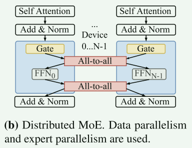

## 03 瓶颈分析

作者总结出all-to-all通信的平均花费时间，大约占到总时间的34%，产生原因不尽相同。

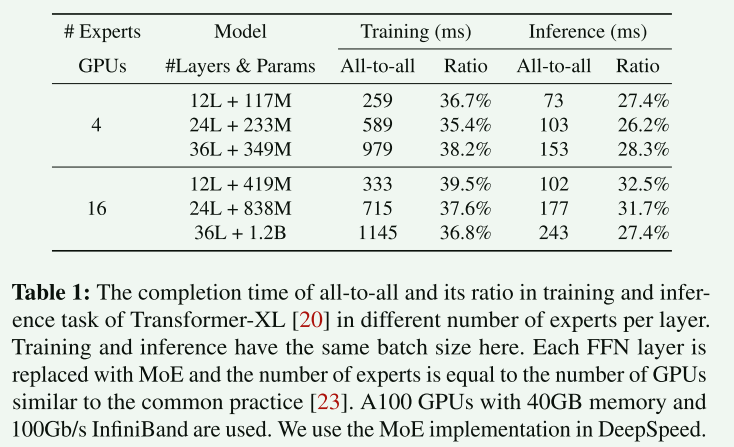

在前向传递中，两次all-to-all能占到74.9%的时间，通过Profile分析得到再all-to-all期间，GPU的效率为3.7%：

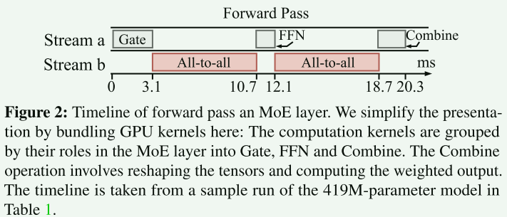

除了专家并行用All-to-All通信来传输token，训练过程中还有非专家参数的数据并行用的AllReduce通信来聚合梯度。这两个通信操作相互独立，有两个专用的cuda stream。但是这两个操作重叠，争夺网络带宽，延长了完成时间。

在推理阶段，因为专家受欢迎程度的倾斜，热门的专家能分到相比冷门专家多4~5倍的token，所以热门专家计算时间更长，同时，冷门专家就被空闲了，造成资源浪费。

## 04 框架设计

通过修改PyTorch的分布式训练的功能来实现DeepSpeed对Lina的支持。

在训练阶段，提高all-to-all的优先级。实现方法时张量划分，将all-to-all和AllReduce的tensors划分成小chunks，每个chunks构成一个micro-op。Lina只有在没有all-to-all等待或正在进行时调度AllReduce micro-op，保证all-to-all中能占用全部带宽。

在推理阶段，根据专家热度动态调整专家分配情况，并通过相邻层的专家选择模式来估计专家受欢迎程度。Lina在每一层进行调度，按比例为受欢迎的专家分配更多设备。

### 1、优先All-to-All

#### 1. 挑战

类似NCCL通信库中的通信原语在调用时不能控制如何与他人共享资源，所以当all-to-all通信迟来，不能抢占allreduce。一种想法是获取未来all-to-all、allreduce的到达时间和运行时间，提前编排。但是获得未来的到达时间和运行时间很困难也不精确。另一种想法是推迟allreduce的时间，等完成偶数个all-to-all之后再启动AllReduce。但是在进入optimization之前必须等待所有AllReduce完成，这可能导致更多的时延。

#### 2. Tensor 切分和 Micor-Ops

Lina将每个梯度tensor切分成等大小的小chunk，并独立执行单个allreduce微操作。如下图所示，我们将梯度划分成5个chunk，使得pytorch原本通过bucket完整的AllReduce可以拆分成5个。在前三个梯度计算完成后，all-to-all开始之前，先AllReduce传输3个梯度。并且在两个all-to-all之间还能穿插一个AllReduce。速度能提升21.7%

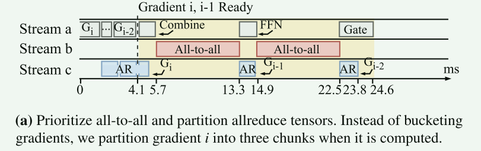

虽然划分传输会产生额外的开销，但是还是优势更大。

除了对AllReduce进行分区，还可以对all-to-all进行分区。有机会进行流水线优化。由于FFN计算是以令牌为粒度的，因此专家可以在一次all-to-all微操作后开始计算令牌子集。简单说就是在一小块all-to-all之后就马上在另一个stream处理传输过来的token。

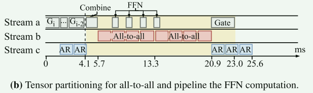

我们希望FFN和all-to-all的micro-op花费的时间接近，这样能充分利用计算能力和带宽。但是FFN micro-op时间远少于all-to-all。所以通过在每个设备上打包多个专家，直到FFN计算量超过all-to-all。在显存不足时，将当前不使用的专家参数offloading到主存。

### 2、在推理中的资源调度

因为专家受欢迎程度不同会导致同一批次的token处理时间不平衡，从而延长处理时间。

#### 1. 挑战

在推理中每个输入，其专家流行度都是不一样的。那么在输入被门控处理之前，我们要如何知道专家的人气分布。

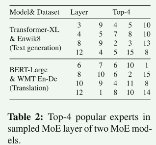

根据专家选择结果来调度资源可能会在收集信息、做出决策调度、协调个专家之间的all-to-all上出现延迟。

#### 2. 基于人气的调度

作者发现MoE层中的专家，在第i层选择了某一类型专家的token往往会在第i+1层再次选择同样的专家。下图显示了两个12层MoE模型中下一层也选择同一组中top-k专家的比率。当k=1时，有41.9%，当k=2时，有54.59%，说明这是有意义的。

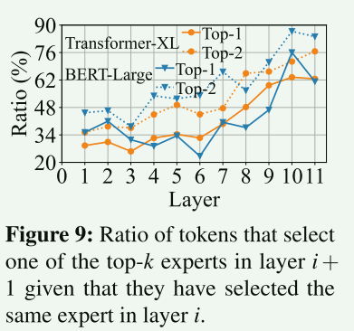

对于热门专家，Lina的估算方法如下：在分析阶段，收集所有token在负载均衡损失最小并趋于稳定时的专家选择结果。然后我们将从第i-l（这里的l表示路径长度，控制精度与成本的权衡，l越大，路径越长，对第i层的估计越精确，但是成本越高）层到第i层选择相同专家的token分组，表示使用的专家在同一路径上。对于每个样本路径j，我们计算第i+1层的专家受欢迎度分布。并且这个分析时在任何MoE层计算之前。

第一阶段：每个MoE层专家人气估计之后，Lina依靠这个估计将受欢迎的专家复制到更多设备上，将冷门专家打包到更少设备上。

第二阶段：Lina在Gate选择实际专家后对基于估计的调度决策进行微调。如果选择相同，则无需微调。否则调度程序按照第一阶段相同逻辑，根据实际专家受欢迎程度重新计算分配资源，这会产生延迟。

## 05 实施

### 1、训练

#### 1. 通信调度器

调度器是部署在所有设备上的，运行单线程，不需要跨设备协调调度器。每个调度器维护一个优先级队列，其中存放micro-ops。如果到反向传递阶段，调度器就会停止启动AllReduce，因为all-to-all即将发生。并且流水线化MoE层的所有的micro-ops。

在MoE模型中切入了一个打包控制器，会在10个训练步骤后动态调整。前向传递中，控制器记录all-to-all和FFN的micro-ops的完成时间，当FFN的micro-ops的完成时间短于all-to-all时，控制器会开始打包专家，将多个专家放到一个设备上。

### 2、推理

#### 1. 资源调度

Inference的资源调度器运行在device 0的专用线程上，对集群的资源进行调度管理。每个设备使用多个unordered_map保存自己的DRAM中的所有专家的权重和收集的分层专家人气分布。如果显存不足，一个device一次只加载一个专家和一个层的流行度分布。

① 对于每个MoE层，每个device将流行度估计通过all-to-all传送到device 0，调度器重新计算新的专家-设备映射关系。通过第二个all-to-all通信来指示每个设备存放哪些专家和多少专家。并流水线化下一层的必要信息。

② 每个device发送信息给调度器来更新专家的受欢迎程度。通过广播经过微调的专家-设备映射。

#### 2. all-to-all 协调

Inference中使用不相等划分的all-to-all，在all-to-all中向每个设备传输大小不相同。如果没有token需要定向到某个设备，可以传送占位符。这可以节省进程开销。当有一个all-to-all的micro-op结束，就马上启动对应的FFN。

#### 3. 专家打包

每个设备每次加载一个专家来执行计算，然后转移到下一个打包的专家。

## 06 实验

训练采用top-2 gate，推理采用top-1 gate

评价指标：

1. 完成一步训练所需的时间；
2. 完成一个batch推理所需的时间；
3. 完成all-to-all的时间；
4. 完成一个MoE层计算和通信的时间；

基线：DeepSpeed、Tutel。

### 1、训练

#### 1. 训练一步所需时间

下图显示了Lina的加速情况，柱状图表示Lina相对与DeepSpeed/Tutel训练Transformer-XL、GPT-2、BERT2GPT2时所需时间所减少的倍数。发现2个专家和8个专家放在一个设备上能获取更大的收益。*因为lina中每个设备放2个专家，2个专家可以存粹数据并行，没有all-to-all。而8个专家可以避免服务器内gpu之间的all-to-all，因为一个服务器有4张卡，刚好每个卡2个专家。*

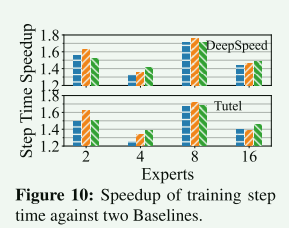

#### 2. MoE层训练时间

下图显示了前向计算和后向计算的加速情况，同样时2个专家和8个专家增益最大。同时由于前向计算不会受allreduce干扰，后向计算中Lina做了对all-to-all和allreduce的专门优化，所以后向计算的增益比前向计算更好。

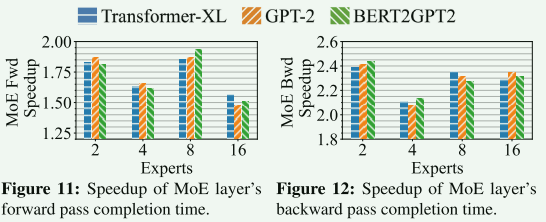

#### 3. GPU利用率和显存使用率

GPU的利用率由于Lina的高效调度平均提高了17.6%，显存利用率也变高了，同时使用主存卸载存储打包后的专家参数。

#### 4. All-to-All时间

通过调整all-to-all通信的优先级，避免allreduce的冲突。专家打包也减少了all-to-all要传输的大小。

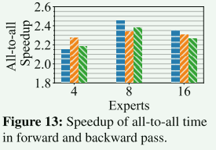

#### 5. 流水线效率

流水线效率位cuda流中所有时间内非空时间的占比。下图证明打包专家能提高流水线效率。

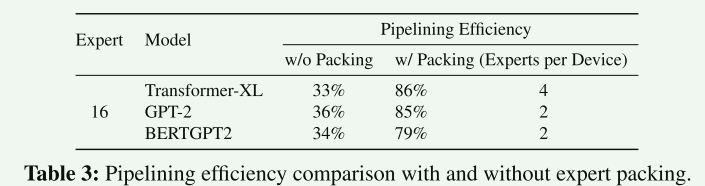

### 2、推理

#### 1. 推理时间

### 3、人气估算

#### 1. 准确率

#### 2. 样本路径长度

### 优化点

1. 在推理中的专家人气估算方面，可以用机器学习技术训练一个模型在收到请求时提前判断token会选择MoE层中的哪些专家。
2. 分布式系统中的通信加速。可以尝试利用GPU/CPU的资源。

