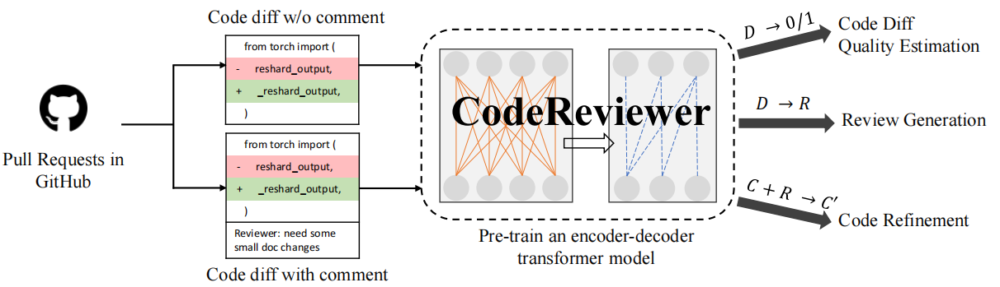
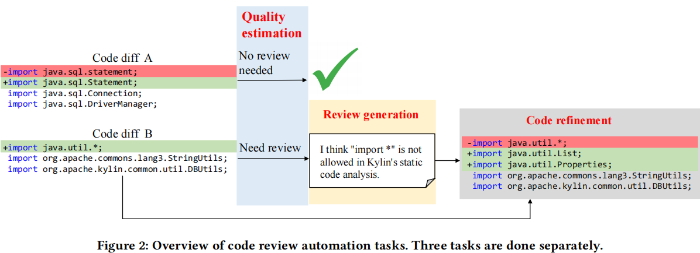
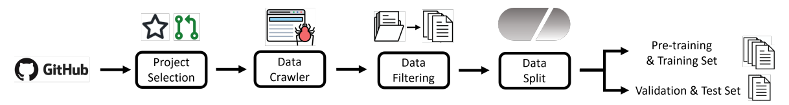
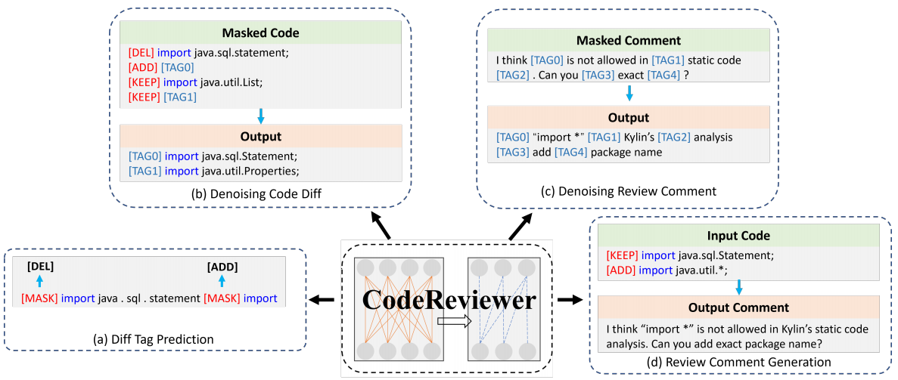
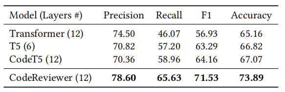
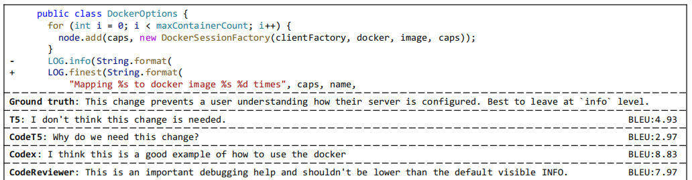

# **Automating Code Review Activities by Large-Scale Pre-training**

[论文地址](https://arxiv.org/abs/2203.09095)

[代码地址](https://github.com/microsoft/CodeBERT/tree/master/CodeReviewer)

## 01 背景介绍

​	代码审查是软件开发中的重要一环，比如在开发者完成代码开发之后，在把代码提交到仓库之前，需要找一位同事来审查一下你的代码。这一过程称为Code Review。在非常多时候，你自己写的代码自己审查是很难审查出问题的，这可能源自你自身的代码书写习惯、思路、知识面等，甚至自身对功能需求的理解偏差。这时候找一个同事，最好是技术比你牛的同事来review下你的代码，能更容易发现代码中不合理的地方，能有效减少程序上的问题。

​	但是如果纯人力来进行review，这对于同事来说是一件又费时又费力的工作。他要检查代码的逻辑、功能、复杂性、风格、文档等多个方面。并且看懂别人的代码本来就是一个耗费经历的工作。所以我们有推动代码审查自动化的需求。

​	

​	先前的研究者已经提出了关于源代码的预训练模型，但是他们很难处理代码审查过程。还有一个用于代码生成的基于GPT3的大模型CodeX，虽然它能生成代码，但是对代码审查不适用。

​	本论文是从reviewers（审查者）和commiters（提交者）的角度出发，专注于与代码审查活动相关的三个关键任务：

​	1、 *code change quality estimation*：代码变更质量评估，预测一个代码差异是否需要审查意见，可以帮助审查者在大量差异中找到更容易有问题的差异；

​	2、*review generation*：评论生成，来减少审查者的花费时间；

​	3、*code refinement* ：完善代码，帮助提交者根据先前代码和评论来完善代码。

​	

​	本模型的数据集来自GitHub上最高星级的项目，包含了9种编程语言，具有完整的代码修改和审查信息。在基准数据集上与SOTA模型相比，本文提出的CodeReviewer模型在三个任务上都优于之前的工作。

## 02 代码审查自动化任务

### 代码审查

​	一轮代码审查流程一般如下：代码修改者更新源代码来完成新功能或者修改BUG，修改者会创建一个request请求，审查过程开始，其他的审查者将来审查代码变动，在必要时提供评论和建议。代码修改者根据评论和建议进行修改，再进行提交。

​	下图显示了三个关键任务的概况：

### 1、代码变更质量评估

​	是预测一个代码变更是否是高质量的，是否可以在审查过程中被接受。这是一个二元分类任务，输入的是代码的变更，输出是否需要评估。

### 2、评论生成

​	是序列生成任务，输入是代码的更改，输出是一个预测的评论。

### 3、完善代码

​	模型将修改者编写的代码和审查者的评论作为输入，并根据评论中的需求生成修订版本的新代码。

## 03 代码审查数据集

现在的很多开发者会把代码放在代码托管平台GitHub，在上面进行代码审查的工作，本数据集也从GitHub上收集。可以通过GitHub的API来获得JSON格式的数据，包括仓库的分支、拉动请求、代码差异、评论等。

### 数据分类工作

三个任务对数据集的要求互不相同。

① 代码质量评估中，有注释的代码修改都被认为是低质量的代码。且没有注释的代码修改的数量大约是有注释的2-3倍，所以要对数据集进行平衡操作；

② 评论生成中，有评论的代码变更将被用于这项任务，且当一个diff涉及到多个评论时，选取最早的评论。

③ 代码完善中，对于每一个有评论的代码修改，去检查这个拉动请求中的所有提交，找到对应的新的提交代码。

### 数据分割

为了防止数据集的信息泄露，我们在项目层面上分割数据。拥有超过2500个拉动请求的代码库被用来建立预训练数据集和基准数据集的训练集。其他具有[1, 500, 2, 500]拉动请求的代码库被用来建立验证和测试数据集。

## 04 CodeReview模型

### 1、模型结构

​	本模型基于Transformer的编码器、解码器结构，由12个编码器层和12个解码器层组成，每个层有12个注意力头，隐藏头的大小为768，模型的总参数大小为223M，用CodeT5的参数来初始化CodeReview。然后用四个预训练任务来预训练模型。预训练完成之后，再进行微调，最后在进行评估。

### 2、输入-输出表示法

​	使用与CodeT5相同的RoBERTa标记发生器来分割源代码并查看对标记的注释。在序列前添加一个特殊的标记[𝐶𝐿𝑆]，形成输入为{[𝐶𝐿𝑆]、𝑐1、𝑐2、···、𝑐𝑛}，其中𝑐𝑖为源代码标记，𝑛为序列长度。diff文件中指示行删除和行插入的特殊行标记“-”和“+”被替换为特殊标记[𝐷𝐸𝐿]和[𝐴𝐷𝐷]，还在每一行不变的行之前插入一个[𝐾𝐸𝐸𝑃]。当输入中同时存在源代码标记和检查注释标记时，将插入一个[𝑀𝑆𝐺]标记来分离这两个序列。因此，输入值为{[𝐶𝐿𝑆]、𝑐1、𝑐2、···、𝑐𝑛、[𝑀𝑆𝐺]、𝑤1、𝑤2、···、𝑤𝑚}，其中ci为源代码token，wi为审查注释token。

### 3、预训练任务

​	设计了四个预训练任务来提高CodeReviewer的能力，让它能理解代码的变化，捕捉代码变化和相应审查意见之间的关系。

① diff标签的预测（DTP）：diff格式中包含了代码的变化信息。在DTP训练中，[ADD]、[DEL]、[KEEP]三种标记会被[Mask]取代，通过模型来预测对应位置上应该为哪个tag。让模型学会区分这行代码是不变还是更新了。也就是让模型预测第i个mask位置的概率分布情况，Loss函数为交叉熵损失。

 L𝐷𝑇𝑃 = − ∑︁ { 𝑦 (𝑖) 0 log 𝑝 (𝑖) 0 + 𝑦 (𝑖) 1 log 𝑝 (𝑖) 1 + 𝑦 (𝑖) 2 log 𝑝 (𝑖) 2 }

② 去噪目标：分为去噪代码差异（DCD）和去噪评论（DRC）。在DCD中，随机选择15% 代码进行屏蔽，目的在于帮助模型学习代码变化的分布。DRC中我们会给予模型一个被破坏的审查注释作为输入，让它试图恢复被屏蔽的内容。

③ 审查意见生成（RCG）：该模型有一个代码更改作为输入，并被要求生成由人类评审员编写的评审注释。我们使用负对数似然损失。

### 4、微调

对分类任务，如代码质量评估，只使用预训练的编码器，在最后一层输入一个线性分类器产生预测。

对生成任务，如完善代码，使用整个预训练的编码器和解码器。

## 05 实验结果

### **问题1**：关于代码变更质量估计的性能

CodeReviewer模型与T5相比，F1和准确性分别提高了8.24%和7.07%。比CodeT5的改进也超过约7%，这表明我们的预训练任务有助于CodeReviewer更好地理解代码的变化。此外，从头开始训练的Transformer的性能不如其他三个模型，说明预训练的重要性。

### **问题2：评论生成方面的表现**

CodeReviewer产生的BLEU分数比基线模型高。然而，我们的模型的BLEU分数仍然低于10，说明这是一个困难的任务。评论是多样化和非唯一的。如下图所示，我们的模型预测传达的意图与基础事实相似。但是他们的词语差别很大，所以BLEU分数比Codex低。

### 问题3：完善代码的性能

CodeReviewer在超过30%的情况下成功地生成了与地面真实情况完全相同的修复代码，这是T5结果的2倍，比CodeT5多出25%，表明CodeReviewer理解代码的能力很强。

### 贡献：

​	① 第一次在CodeReview场景下使用code diffs作为输入；

​	② 新颖的预训练任务，帮助模型更好理解code changes和生成任务；

​	③ 整理了一个大规模的CodeReview的预训练数据集；

​	④ 相比先前模型，本模型在各个任务上表现更加优秀；

