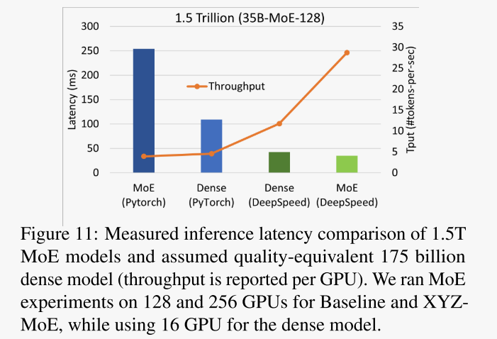

# DeepSpeed-MoE

## 01 背景介绍

大模型训练十分消耗资源。以Megatron-Turing NLG 530B为例，需要使用2000个A100，消耗3 million GPU hours才能达到收敛目标。想要借助MoE来使用更少的资源达到收敛目标。

自MoE被提出后，业界基本有了共识：与收敛效果相同的Dense模型相比，使用MoE结构的模型具有很低的训练成本。**但在推理方面，如何为带有MoE的大模型提供更好的并行加速，依然是challenge task。**

这篇文章提出了针对MoE的训练和推理的端到端解决方案，命名为DeepSpeed-MoE，并嵌入在DeepSpeed library中。

贡献点：

① 将基于MoE的模型的适用范围扩大到NLG（自然语言生成）任务，使其训练成本下降；

② 开发PR-MoE架构在不改变模型质量的情况下减少3倍的参数。

③ 开发DeepSpeed-MoE推理系统，降低推理的延迟和成本。

## 02 相关技术

### 1. 专家混合模型MoE

将大模型拆分成多个小模型，对于一个样本来说，无需经过所有的小模型，而只需激活一部分小模型来进行计算，节省计算资源。并且引入了稀疏门机制来选择激活哪些小模型。

MoE模型自身的挑战：

​	**① 范围有限**，MoE模型的应用范围主要限于编码器-解码器模型和序列2序列任务，MoE在NLG方面的计算成本相对要高几个数量级。

​	**② 大量的内存需求**，MoE模型因为是稀疏型的，需要更多的参数数量。

​	**③ 推理性能有限**，更大的参数规模需要更多的GPU来拟合，但多GPU推理技术并不是为基于MoE的模型而设计的。由于推理通常受到内存带宽的限制，基于MoE的模型可能比其密集模型大10倍，可能需要10倍以上的可实现内存带宽来实现与密集模型类似的推理延迟。

### 2. 知识蒸馏Knowledge Distillation

知识蒸馏主要用于模型压缩和迁移学习中。

在一般情况下我们不会去区分训练和部署使用的模型，但是训练和部署之间存在着一定的不一致性：在训练过程中，我们需要使用复杂的模型，大量的计算资源，以便从非常大、高度冗余的数据集中提取出信息。在实验中，效果最好的模型往往规模很大，甚至由多个模型集成得到。而大模型不方便部署到服务中去，常见的瓶颈如下:

1. 推断速度慢
2. 对部署资源要求高(内存，显存等)

在部署时，我们对延迟以及计算资源都有着严格的限制。因此，模型压缩（在保证性能的前提下减少模型的参数量）成为了一个重要的问题。而”模型蒸馏“属于模型压缩的一种方法。

知识蒸馏使用的是Teacher—Student模型，其中teacher是“知识”的输出者，student是“知识”的接受者。知识蒸馏的过程分为2个阶段:

1. 原始模型训练: 训练"Teacher模型", 简称为Net-T，它的特点是模型相对复杂，也可以由多个分别训练的模型集成而成。我们对"Teacher模型"不作任何关于模型架构、参数量、是否集成方面的限制，唯一的要求就是，对于输入X, 其都能输出Y，其中Y经过softmax的映射，输出值对应相应类别的概率值。
2. 精简模型训练: 训练"Student模型", 简称为Net-S，它是参数量较小、模型结构相对简单的模型。同样的，对于输入X，其都能输出Y，Y经过softmax映射后同样能输出对应相应类别的概率值。

在知识蒸馏时，由于我们已经有了一个泛化能力较强的Net-T，我们在利用Net-T来蒸馏训练Net-S时，可以直接让Net-S去学习Net-T的泛化能力。

## 03 PR-MoE（Pyramid-Residual-MoE）

将标准的MoE应用在NLG模型上，虽然训练成本降维了原来的1/5，但是所产生的模型参数为原来的8倍多。这么多的参数会给内存和内存带宽带来压力。

提出PR-MoE架构是为了减少参数数量，提高基于MoE的模型的参数效率。

首先，作者发现标准的MoE架构中的所有MoE层中都有相同数量、相同结构的专家。那么在神经网络中，是否所有的层都学习了相同的表示呢？我们知道在CV中，浅层会学习一般的特征，比如线条，深层会学习更客观的特定表征，比如鼻子、眼睛等。但是在NLP中没有发现这种特征。

作者做了一个对比实验，1）把MoE层放在模型的前半部分，后半部分与原模型相同；2）把MoE模型放在后半部分，前半部分与原模型相同。

作者发现第2种放置方法的性能更好。证实了并非所有的MoE层都能学习到相同水平的表征。相同数量的专家，放在Model越深的位置，效果会越好。

其次，当我们想增加MoE模型的泛化性能时，有2种常见方法：1）在保持Top-1专家选择的基础上增加每层专家的数量，但会增加训练资源的内存需求；2）在保持专家数量不变的情况下使用Top-2专家选择，即每层选择2个专家，但会增加通信量，减慢训练和推理速度。

有一个问题：为什么更多的专家会提高准确性？直觉上认为是后面的专家能纠错前面的专家。那么引入了一个新的问题：第一个专家还有没有选择的必要呢？

作者做了一次比较：1）Top2-MoE；2）固定第一个专家并且类似残差网络将token分别经过MLP和MoE专家后的输出相加得到最终输出。2）中实现了每层使用2个专家的好处，并且通信量与Top1-MoE相当。

基于上述2个对比实验，发现神经网络中的后几层可以利用MoE带来更多的好处，所以在新架构中在最后几层添加更多的专家，形成类似金字塔结构。同时在每一层中添加了一个固定的MLP模块，token会同时通过MLP模型和另一个选定的专家，然后再把它们的结果相加，产生类似残差的效果。

相对于之前的标准MoE，PR-MoE具有更少的参数量，更高的吞吐率，以及不差的精度。

因为PR-MoE模型每层的专家数不相同，所有每层的专家并行度会有区别。未来解决不同MoE层的训练平衡问题，开发了灵活的多展架和多数据并行设计，允许以不同的专家和数据并行程度训练模型的不同部分。例如在128个GPU上运行PR-MoE，在不同的MoE层有32、64、128个专家，那么在32个专家的层可以4路数据并行，64个专家的层可以2路数据并行，128个专家的层可以1路并行。

## 04 MoS（Mixture-of-Students）

设计了一种新的MoE-MoE知识蒸馏技术，创建了一个PR-MoE的蒸馏版本，称为Mixture-of-Students（MoS）。PR-MoS并不是新的模型结构，而是PR-MoE的Student版本。减少了教师模型中每个专家分支的深度，以获得相应的学生混合模型。

### 1. 通过分阶段知识蒸馏提高学生的精确度

在MoE的知识蒸馏过程中，有个有趣的现象：使用teacher PR-MoE相比于从零训练一个PR-MoE student 会有更低的精确度。由于KD通常能提高student的泛化能力，所以引出一个问题为什么在生成型语言模型的MoE上，KD不能提高其准确性。

作者进行了实验分析：

下图显示了从零开始训练的PR-MoE和使用Knowl edge distillation与其老师之间的验证损失的比较。

发现虽然KD损失最初提高了验证的准确性，但在训练的最后阶段（例如，在400K步之后），它开始损害准确性。作者推测是因为PR-MoE已经通过更有效的架构减少了参数，减少了模型容量，然后知识蒸馏进一步降低模型深度可能导致学生的容量不足，使其欠拟合。所以Student PR-MoE可能没有足够的能力同时最小化训练损失和知识蒸馏损失。所以希望能逐渐减弱KD的影响，或者训练过程早停止，在训练过程中只针对标准语言建模损失进行优化。

下图显示了在40万步时停止KD的loss曲线。发现跟我们想的一样，分阶段的KD使我们得到了一个学生模型与教师模型相似的验证曲线。

在深度减少12.5%的情况下，分阶段KD的MoS实现了接近teacher模型的99%以上的性能。

## 05 DeepSpeed-MoE推理

这部分是为了优化推理延迟和成本。在推理过程中，批处理量比较小，所以MoE模型的推理延迟主要取决于从主存储器加载模型参数所需的时间。MoE推理性能取决于两个主要因素：整体模型大小和整体可实现的内存带宽。

之前的PR-MoE和MoS已经减少了模型大小。

针对内存带宽部分，作者提出了**多GPU MoE推理系统**，最大限度地利用数百个GPU之间的聚合内存带宽。

### 1. 推理系统的设计

**① 专家、张量、数据并行**

通过张量并行来切分非专家参数，通过专家并行来切分专家参数。但是由于张量并行的通信开销较大，它智能有效地扩展到几个GPU。我们将专家并行与张量并行结合，使其能扩展到数百个GPU。并且为了将非专业计算扩展到相同数量的GPU上，还使用了无通信开销的数据并行。

专家部分使用专家并行和专家切分（张量并行）；

非专家部分使用数据并行和张量并行；

**② 通信优化 分层all to all**

All-to-All是衔接前后不同切分策略的重要手段，这是一种重要的Reshard过程。任何涉及到跨机的通信都会被低跨机带宽所拖累，所以在这里对All-to-All做了变种，通过先在机内做All-to-All，再机间做All-to-All的方式优化通信过程。

下图中可以看到，在机间做All-to-All时，并不是每个GPU对所有的参与者都做通信，而是GPU 0 <-> GPU 2， GPU 1 <-> GPU 3同时做。为了保证正确性，每次All-to-All之前，都要补做一次transpose。

分层化的all-to-all实现分为2步：首先是数据布局的转换，节点内的all-to-all；再是数据布局的转换，最后节点间的all-to-all。

这种方式虽然通信量增加了2倍，但是能更好地扩展小批量的通信。

**③ 内核优化**

我们知道在Gating路由选择的时候，要通过one-hot向量标记每个tensor发送给哪个expert。然而作者发现这里有很好的优化空间，通过将sparse tensor改写成mapping表，并重写sparse einsum操作可以提升性能。

### 2. 推理系统性能

**①** **同时实现低延迟和超线性的吞吐量增长**

将一个52B MoE模型（13B基本模型和128个专家）从8个GPU扩展到64个GPU，并观察延迟和吞吐量趋势。基准程序是PyTorch的MoE。

上图显示随着GPU数量的增加，两者都减少了推理的延迟，但是DeepSpeed-MoE的延迟低得多。并且将GPU数量从8增加到64个时，DeepSpeed-MoE获得了每个GPU的吞吐量的增加，与PyTorch-MoE形成鲜明对比。

**② 在前所未有的规模下实现低延迟和高吞吐量**

上图显示了具有1万亿和2万亿参数的两个MoE模型的性能和吞吐量。与基线相比，DeepSpeed-MoE实现了高达7.3倍的延迟降低，同时实现了高达7.3倍的吞吐量，延迟可以在25ms以内。

**③ 叠加PR-MoE和MoS**

通过叠加这两者，能使MoE推断所需的资源（GPU数量）减少为1/2。能进一步有改善延迟和吞吐量。

**④ 比质量相当的密集模型有更好的延迟和吞吐量**

由上两张图发现，当使用PyTorch时，与其质量等效的密集模型相比，MoE(PyTorch)推理更昂贵更慢。而DeepSpeed-MoE则更快、更便宜。

## 参考资料

1. [【经典简读】知识蒸馏(Knowledge Distillation) 经典之作 - 知乎 (zhihu.com)](https://zhuanlan.zhihu.com/p/102038521)
2. [对MoE大模型的训练和推理做分布式加速——DeepSpeed-MoE论文速读 - 知乎 (zhihu.com)](https://zhuanlan.zhihu.com/p/466363675)
3. [Mixture-of-Experts (MoE) 经典论文一览 - 知乎 (zhihu.com)](https://zhuanlan.zhihu.com/p/542465517)
4. 

