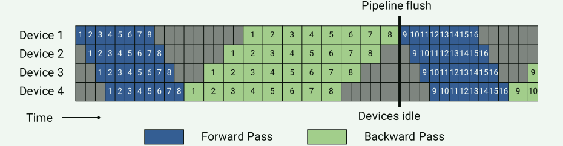
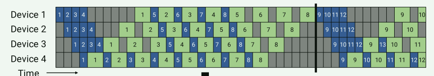
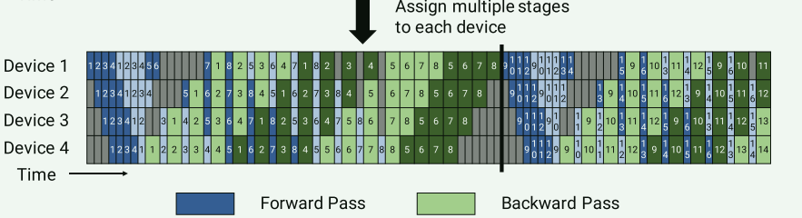
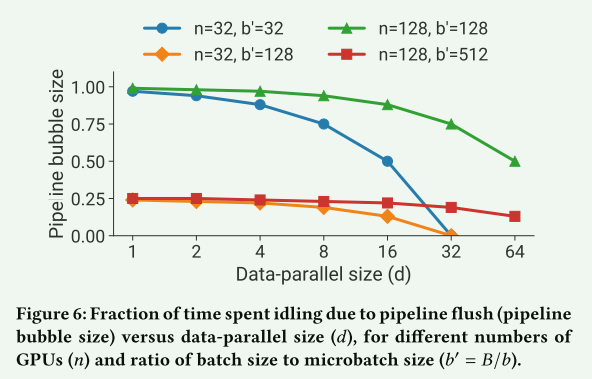
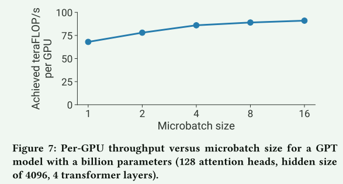
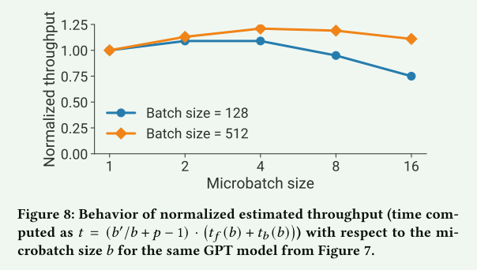
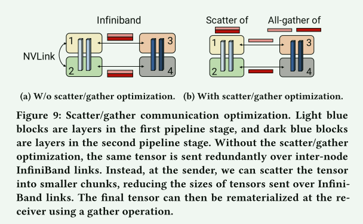

# Efficient Large-Scale Language Model Training on GPU Clusters Using Megatron-LM

## 01 背景介绍

老生常谈的基于Transformer的NLP模型规模变得非常大。训练这样的大模型带来两个挑战：

1. 即使当今显存最大的显卡也不再能存放模型的完整参数；
2. 通过GPU和主存交换参数的方式我们能在单卡训练大模型，但是会带来不切实际的训练时长；

所以我们需要并行性，数据并行有两个限制：

1. 在数据并行中我们一般使用小batch size，过大的batch size会加剧显存紧张，而小batch size会降低GPU利用率并增加通信成本；
2. 可以使用的设备的最大数量就是batch size，限制了用于训练的加速卡的数量；

在Mesh-TensorFlow和Megatron-LM中提出的张量并行，将Transformer层内的矩阵乘法分割到多个GPU上，可以解决上述两个问题。但是对超过200亿个参数的模型的效果不好，会出现问题：

1. 张量并行需要在服务器间进行all-reduce通信，而服务器间的链路带宽要比GPU间的带宽慢很多；
2. 高度的张量并行可能会产生很多小矩阵乘法(GEMMs)，会降低GPU利用率；

流水线并行是另一种方式，提出的有DAPPLE、GPipe、PipeDream等方法。这种方法是将模型按层进行划分，可以将不同的层划分给不同的GPU，并且进一步将batch分割成micro-batch。但是为了保持严格的optimizer semantics，优化器的步骤需要与多台设备之间同步，会导致每个批处理结束时进行pipeline flush。micro-batch越大，在流水线中pipeline flush所花费的时间越少。所以为了提高效率，通常会用较大的批量。

本文要解决的问题：

**如何将并行技术结合起来，以最大限度地提高给定批量大小的大型模型的训练吞吐量，同时保留严格的优化器语义？**

本文通过整合流水线并行、张量并行、数据并行，提出PTD-P技术。利用跨多GPU服务器的流水线并行、多GPU服务器内的张量并行和数据并行的组合，在集群中训练万亿参数模型。

## 02 相关技术

### 1. 数据并行

每个worker都有完整的模型副本，把输入的数据集切分，计算完之后worker要定期汇总梯度，确保所有worker看到的是一致的梯度和参数权重。

### 2. 流水线并行

通过流水行，一个模型可以按层切分，分散到多个设备上，每个设备被分配相同数量的Transformer层来提高流水线的效率。

**① GPipe**：将batch进一步切分为micorbatches，先执行微批次的前向传递，再执行微批次的后向传递。管道气泡的大小随着切分的粒度越细而越小，每张卡的空闲时间为(p-1)*(tf+tb)，**理想情况是microbatch的数量 >> worker的数量。但是这样会有一个问题，会导致每个worker需要存储很多微批次的中间激活值，占用很大的存储空间。**

**② PipeDream-Flush**：在warm-up阶段，workers执行不同次数的前向计算，只要有一个微批次的所有阶段的前向计算完成，马上一有机会就开启它的后向计算，简称1F 1B。反向执行完后能马上释放该阶段的内存。所以当microbatch的数量 >> worker的数量时，PipeDream-Flush相比GPipe有更好的存储效率。

**③ 有交错阶段的调度**：核心思想是让每张卡承载多个stage，上图中每个卡只有一个stage，下图中每个卡有2个stage，可以将模型切分得更细。比如一个16层的Transformer模型，在四张卡、stage为2的情况下可以将模型切分为8个stage，每张卡上放2个stage。设备1原来存放模型的1-4层，现在存放模型的1、2、9、10层。每张卡的空闲时间变为$\frac{(p-1)*(t_f+t_b)}{v}$。泡沫时间减少了但是带来了更高的通信代价。

### 3. 张量并行

例如Megatron，将Transformer层中的self-attention层和MLP层进行切分和放置。详细不再重复。

## 03 并行结构化的性能分析

### 1. 张量并行和流水线并行

之前分析得到流水线的每张卡气泡占比为$\frac{p-1}{m}$，p(流水线的并行维度)可以表示为$\frac{n(表示GPU的数量)}{t(表示张量并行的维度)}$，所以得到$\frac{n/t-1}{m}$，随着t的增加，气泡占比会下降。

但是张量并行的增加会导致通信量的上升。通常服务器间的通信会成为瓶颈。

**要点一：当同时使用tensor和pipeline并行训练超大模型时，tensor并行的数量通常可以简单设置为一个计算节点内的卡数，而pipeline并行则可以调大，直到集群放下模型为止。**

### 2. 数据并行和流水线并行

当数据并行的维度增加时，会使气泡变小，但是不能一直增加数据并行的维度，因为会占据很大的内存容量。

### 3. 数据并行和张量并行

使用张量模型并行性，需要为每个microbatch执行all reduce通信。这在多GPU服务器中可能是昂贵的。另一方面，数据并行只需要每个batch执行一次昂贵的all reduce通信。

**要点二：当使用数据和模型并行混合时，总共的模型并行维度 $M = t * p$ ，应该确保可支撑模型可以成功放在GPU中支持训练，数据并行维度则可以调大使用更多GPU增大模型吞吐。**

### 4. Microbatch Size

microbatch的size也会影响模型训练的吞吐量。单个GPU上microbatch size越大，则一定程度上吞吐量越大。

但是，microbatch size不是越大越好。通过计算不同microbatch size时一个批处理所花费的总时间，可以得到下图，当参数量在十亿级别时，microbatch size的最佳值为4。

**要点三：最优的microbatch大小会受到模型吞吐以及内存大小的影响，同时，pipeline的维度，数据并行维度，和全局batchsize大小，在固定集群数量的情况下，也会影响microbatch的最优取值。**

### 5. 激活值重算

重计算（激活检查值点）是一种以时间换内存的技术，即在反向计算时重新计算一遍激活值进行求导，从而避免了前向时保存激活值节省内存。

**要点四：每隔一到两层transformers进行一次重计算，对于内存和时间是较优的。**

## 04 实施

在Megatron-LM的基础上实现PTD-P，使用pytorch和NCCL通信库。

### 1. 通信优化

利用张量并行和管道并行来减少跨节点通信的开销。作者发现

## 参考资料

1. [昇腾大模型|分布式并行-5——基于Megatron-LM的大模型训练并行模式思考 - 知乎 (zhihu.com)](https://zhuanlan.zhihu.com/p/627996145)
2. 

