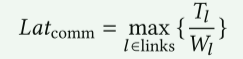

# FasterMoE

## 01 问题

MoE模型引入稀疏的专家之后，带来了新的问题：

1. **动态负载不平衡**：训练过程中token经过Gate被发送到不同的专家，热门专家会收到更多的token，导致GPU负荷过大，其他GPU会被空闲。并且这种不平衡会在不同迭代之间动态变化。
2. **低效的同步执行模式**：所有专家都需要从其他worker上获得输入，这种All-to-all通信最耗时，因为需要所有专家同步启动，但是专家又具有不平衡性。
3. **拥塞的All-to-all通信**：All-to-all通信会和AllReduce通信并发，同时抢夺通信带宽，阻塞通信和计算。

提出FasterMoE:

1. **为了捕捉MoE引入的动态行为，为训练任务构建了精确的性能模型。给定MoE模型和系统配置，该模型能先估计操作的延迟，然后可视化任务。**
2. **启用动态阴影以减少由于专家选择不平衡而导致的空闲。**
3. **提出细粒度的智能调度策略，实现计算和通信操作的异步执行，提高操作并行性。**
4. **设计一种避免拥塞的专家选择策略，来降低迭代的延迟，改进收敛结果**

## 02 性能建模

### 1、负载感知计算模型

预测transformer中MLP层正向计算延迟的公式：

𝐵𝑤表示worker 𝑤上的批大小，因为不同worker上模块的批大小可能在专家并行度上有所不同。𝐻为令牌嵌入向量的长度，𝛼𝐻为MLP中FC层之间的中间嵌入长度。单个FMA操作对应2个操作，每个FC操作对应2个𝐵𝑤𝛼𝐻2操作。有2个fc，结果是常数因子4。𝑃𝑤表示𝑤执行GeMM的平均吞吐量。端到端延迟是每个worker的最大延迟，因为所有worker在计算之后都必须交换特性。因此，该公式反映了计算中的负载不平衡。

### 2、拓扑感知通信建模

假设通信的开销延迟微不足道，没有拥塞、带宽可以被充分利用。假设连接l在单方向的带宽为Wl，流量大小为Tl，端到端的通信时延计算公式如下：

链路上的流量取决于算法和路由策略。常见的通信有以下三种：

1. All-to-All：将token路由到所需的专家。在所有工人两两之间创建连接。
2. All-Reduce：用于数据同步，数据并行中同步梯度和模型并行中向量embedding。
3. Broadcast和reduce：利用环形连接和流水线来降低发送延迟。

### 3、DDL-Roofline 模型

提出一个分布式深度学习的Roofline模型来表征特定训练任务在集群上的性能。

定义计算通信的比率Rcc，并在X轴上表示。当Rcc > 1时说明延迟以计算时间为主，否则以通信时间为主，表明了不同的优化方向。

Y轴用P表示，表示所有workers的平均计算吞吐量。在MLP中计算公式如下：

分子是所有专家对所有token要处理的总计算量。分子是N个worker的总延迟。

理想情况下通信和计算同时进行，公式如下：

半理想情况指充分利用硬件下同步方式执行训练，延迟是通信、计算延迟之和，公式如下：

数据并行中all reduce会导致开销太大，但是all reduce可以和反向计算重叠，使其上移一点。

模型并行的all reduce使对矩阵执行的，通信量更少，但是它不能和计算重叠。

专家并行由于负载不均衡，计算延迟更大，所以它Rcc很大但是P很低。是本文主要优化的点。

## 03 模型引导的优化方法

### 1、轻量动态阴影策略

对于负载失衡问题，是否可以用复制热门专家的模型参数来代替转移嵌入向量的延迟。因为所有专家要处理的token输入可能大于模型的参数量，所以复制专家参数在本地计算会比all-to-all传输token更省时间。

但是专家的流行程度会一直变化，不能简单得缓存模型参数，要进行更新。并且需要全收集梯度统一更新，会引入额外的延迟。

所以要利用之前提出的性能模型来分析专家是否需要被复制。

**在复制影子专家时要先将参数广播到所有workers，再提取出模型，在本地token上计算。在后向计算阶段每个worker分别计算出专家的梯度，然后通过reduce操作同步梯度，再在流行专家最初的worker处执行参数更新。**

以下2中条件可以开启影子专家的条件：

1. 传输token的开销要大于传输模型参数；
2. 减少的计算延迟大于增加的reduce通信开销；

### 2、异步细粒度智能调度

将任务划分为更小的部分，重新调度精细的通信和计算操作，能更好地重叠通信和计算操作。

在专家并行中，将worker切分成更细粒度的group来拆分all-to-all通信。这些group向其他组发送数据。并且将具有紧密联系的worker分配到同一组。

MoE中先进行一次All-to-All，再计算FNN，再进行第二次All-to-All，在步骤j中，i组中的worker执行以下三个步骤：

通过并行减少端到端，但是要遵循前后依赖关系，S->C->R

图c中，因为组2比组3的开销更低，所以将组2放在计划的最后一个位置可以降低e2e的延迟。

### 3、避免竞争的专家选择策略

设计**拓扑感知Gate**，通过考虑具体硬件的网络拓扑结构，提高训练吞吐量。

如果多个token的最佳选择在另一个节点上，则允许得分最高的token离开。其余的则在本地节点中重新选择他们想要的专家。减少网络的通信量。

## 04 实验

