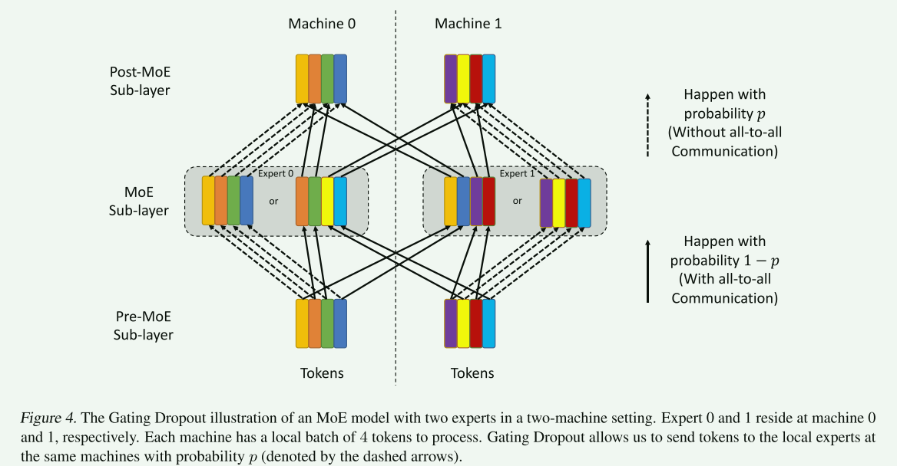

# Gating Dropout: Communication-efficient Regularization for Sparsely Activated Transformers

## 01 背景

发现MoE模型训练中All-to-all通信开销十分严重。

**本文创新点：提出Gating Dropout策略，允许token忽略门控网络，使token停留在本地机器上，减少跨机通信。甚至能像传统的dropout，提升模型泛化性能。**

