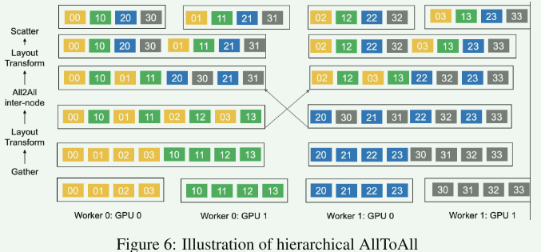

# HetuMoE

## 01 问题

现有的MoE框架在可用性和效率方面仍然面临一些限制：

1. 仅支持部分主流MoE和Gate；
2. 需要集群之间的超高速带宽；

下图是单机8张A100环境上使用DeepSpeed-MoE框架的耗时情况，Gate 加 all-to-all的时间超过50%：

如果扩展到多节点的分布式场景，且网络带宽只有100Gbps，Gate 加 all-to-all的时间会占用99%

HetuMoE采用了多个定制的Gate，并且利用分层All-to-All优化通信。

## 02 Gating Strategy

原来的MoE使用Top k和容量因子C来强制每个专家接收到token的最大数量。以此平衡计算效率和模型性能。

**kTop1**：将专家分成k个原型，每个token分配给每个原型中得分最高的专家，最后对于相同的输入token，不同原型的输出相加在一起；

**Hierarchical TopK**：将专家按设备划分为不同的组，并激活同一组中的多个专家，避免设备间的远程通信开销，先选择一个组，然后为每个token选择同一组中的多个专家；

**BaseLayer**：将token到专家的分配表述为以一个线性分配问题；

**HashLayer**：利用hash函数将token映射到专家；

**Dense-To-Sparse**：先从一个稠密的Gate开始，将token路由到所有的专家，然后逐渐、自适应地变稀疏，路由到更少的专家；

## 03 优化

### 1、Gate优化

HetuMoE中支持多种Gating策略，主要优化topk操作，通过改变专家的数量和tokens的数量，相比原生的topk提高了25%

### 2、Layout Transform 优化

在Gate之后，token得到专家映射，要将分配给同一个专家的token放在物理上连续的内存位置。通过内核级优化来加速这个过程。

### 3、All-to-All优化

目前NCCL、MPI中实现的All-to-All操作可能由于消息规模小而导致网络带宽利用率低。

利用分层All-to-All，结合分层网络和消息聚合，优化多个节点之间的通信。

1. 将一个节点内所有GPU的数据收集到一个GPU中；
2. 进行数据布局转换，将分配给相同节点的token放置在物理连续的存储器中；
3. 启动节点之间的All-to-All通信；
4. 进行数据变换和分散操作，将每个token交给相应的专家；

这种分层方式能增大节点之间传输的数据大小，也能充分利用节点间带宽和节点内带宽。

