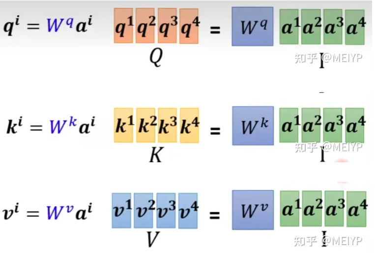
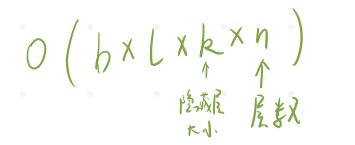

# Megatron-LM：使用模型并行性训练数十亿参数的语言模型

## 01 背景介绍

由于内存的限制，非常大的模型在训练时可能相当困难。在这项工作中提出了训练非常大的Transformer模型的技术，并实现了一个简单、高效的层内模型并行方法，可以训练具有数十亿参数的Transformer模型。实现了在512个GPU上训练83亿个参数模型。

作者在WikiText103和LAMBADA数据集上训练了GPT2模型。在RACE数据集上训练了BERT模型。

主要贡献：

1. 在现有的PyTorch实现的Transformer的基础上只做几个有针对性的修改，就能实现简单有效的模型并行方法；
2. 对本模型并行和数据并行技术进行验证分析，证明使用512个GPU，扩展效率高达76%；
3. 在Bert模型中仔细注意归一化层的放置位置对准确性提高很大；
4. 证明扩大模型规模可以提高GPT-2和BERT的准确性；

## 02 相关技术

**模型并行：**一般指将一个模型的不同的层放到不同的GPU上，来达到一个并行的效果，例如Gpipe在这之中加入了流水线。

**张量并行：**Megatron是通过把一个层中间切开，放到不同GPU上。所以跟一般讲的模型并行有不一样的地方。

## 03 模型结构

### 0. 原Transformer层结构

输入通过Embedding和Dropout，先进入Attention子层，再进入MLP层。

### 1. 细看MLP层

切分之前，输入先通过归一化层，再进入MLP子层，通过激活函数GeLU，在进入MLP子层，最后通过Dropout子层。

然后进行切分。可以分成三种情况：

1. 若输入X太大，可以将X横切，相当于数据并行；
2. 若中间的权重太大，可以将A横切，X被迫竖切，但是X*A的中间结果需要先通信相加再进入激活函数；
3. 将A竖切，每个GPU存储完整的X，每个GPU得到一部分X*A的完整结果，可以各自进入激活函数，无需先通信；

### 2. 细看Attention层

先回顾一下self-attention的计算过程：

以输出b1为例，每个输入a先与三个权重Wq、Wk、Wv矩阵相乘，得到各自的q、k、v矩阵。再让q1与各个ki矩阵相乘，得到a1与各个输入的相关程度α1i（包括自己）再通过softmax函数得到α'1i。再将各个α'1i与各自的vi矩阵相乘相加得到输出b1。

所以上述提到的Wq、Wk、Wv矩阵就是我们要学习的参数矩阵。

在了解self-Attention的原理之后，我们将Multi-head-Attention进行划分，把每个头划分到不同的GPU上，在每个GPU上得到独立的完整结果，最后通过All Reduce通信得到完整的输出：

### 3. 细看Embedding层

输入X是b\*l的矩阵，然后去大小为v\*k的词典编码，得到b\*e*k的输出。

可以把词典横切：

### 4. 细看输出层

输出层的输入X是bl\*k，再去字典反编码，得到2份bl\*(v/2)大小的值放在不同GPU上。然后在各自取exp，按行求和得到两列输出，再将两列输出做all reduce求和，得到完整输出，做softmax，再去算损失函数。

### 5.代价

每个块各自运算完之后，都会得到两个独立的结果，再进入下一个块之前要先通过all reduce得到完整的结果。所以会有很多额外的通信开销，并且计算和通信无法并行。

分析它的通信量：每次发送是（b × l × k / 2），要发送2次，并且有n层。

## 04 实验

### 1. 实验环境

选用模型：GPT-2、BERT；

数据集：174GB的聚合语料库，内容来自Wikipedia、CC-Stories、RealNews、OpenWebtext，并做了优化；

训练优化和超参数：使用混合精度训练、使用Adam、权重衰减、droupout率为0.1，使用激活检查值点，GPT-2模型中l = 1024、b = 512、迭代300k次。

设备：32台DGX-2H服务器，总共有512张Tesla V100显卡，每块32G显存。同时服务器内部GPU之间带宽有300GB/s，服务器之间有100GB/s带宽。

## 05 总结

在这项工作中，我们通过对现有PyTorch Transformer进行少量修改来实现模型并行，成功地克服了传统的单GPU/模型训练所带来的限制。

我们在具有8路模型并行性的512个NVIDIA V100 GPU上高效地训练了多达83亿个参数的基于Transformer的模型，并在整个应用程序中实现了高达15.1 PetaFLOPs的持续性。

我们还表明，对于BERT模型，随着模型大小的增加，仔细注意BERT类模型中层归一化的位置对于实现更高的准确性至关重要。

我们研究了模型大小对下游任务准确性的影响，并在下游任务上取得了上级的结果，并为WikiText 103，LAMBADA和RACE数据集建立了新的SOTA。

最后，我们开源了我们的代码，以使未来的工作能够利用模型并行转换器。
