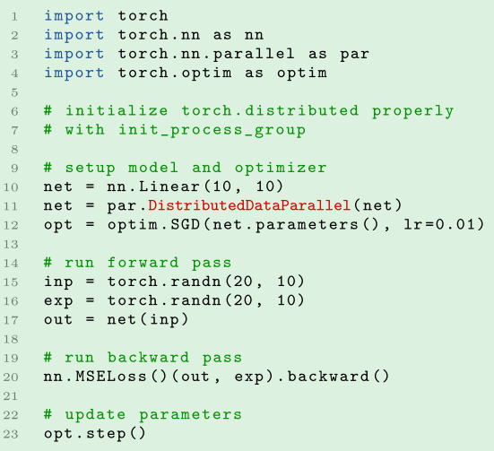
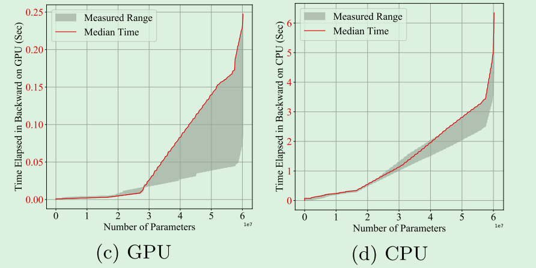
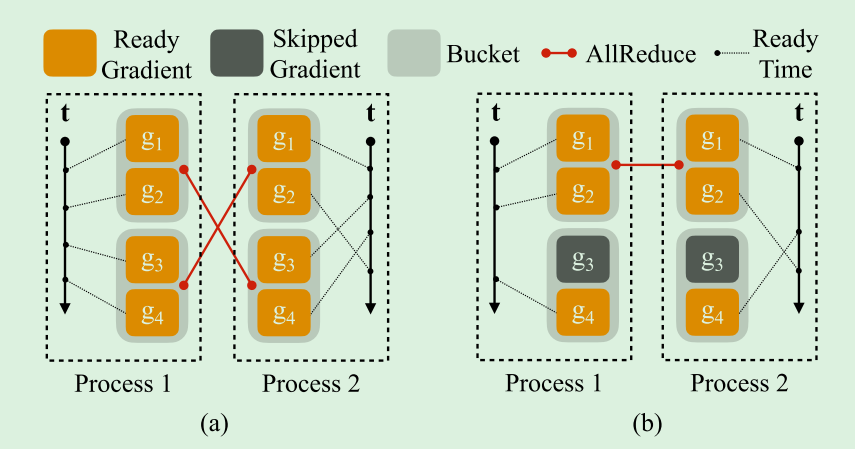
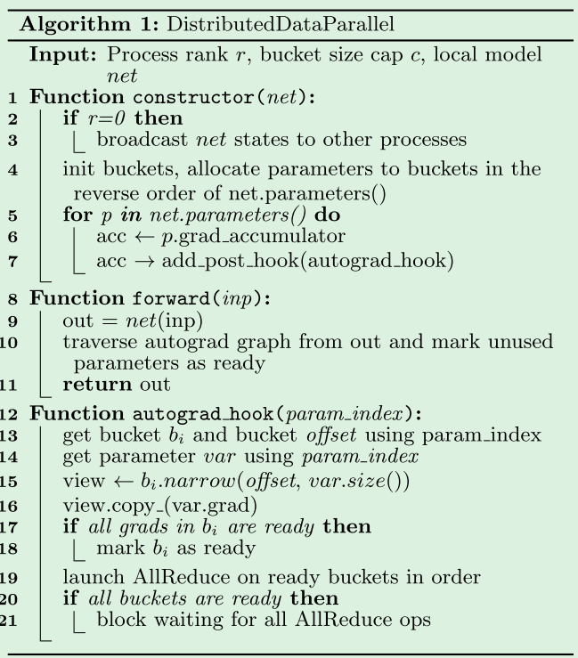
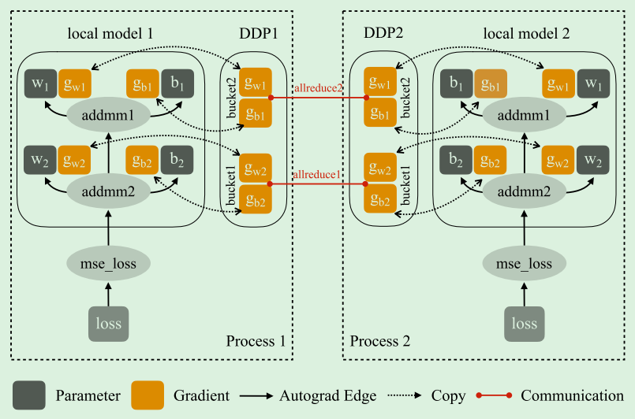
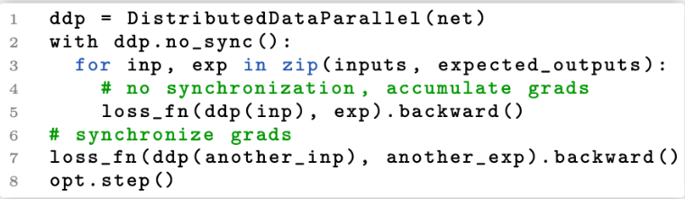
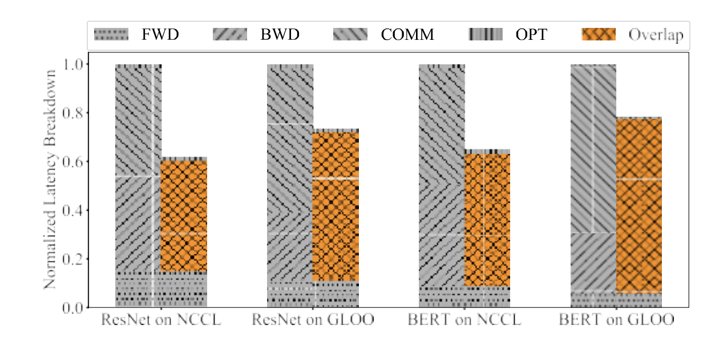
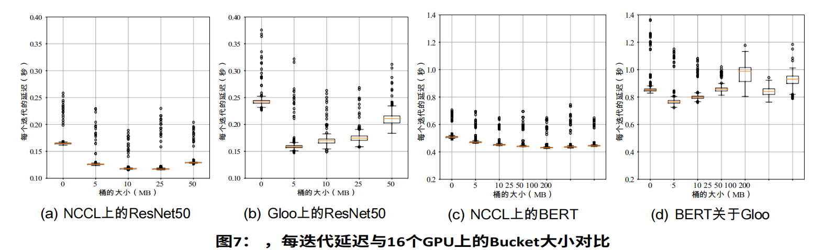
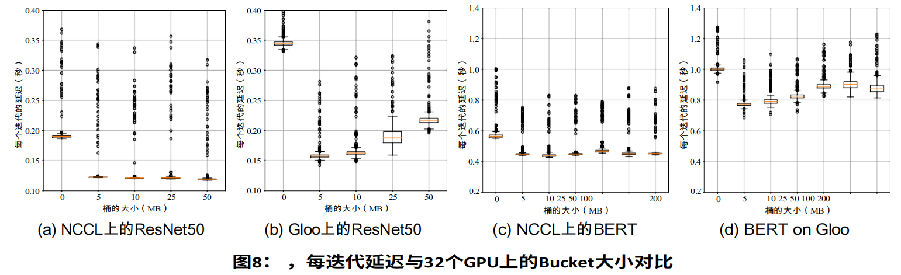

# PyTorch Distributed: Experiences on Accelerating Data Parallel Training
## 01 背景介绍

**本文介绍PyTorch分布式数据并行模块的设计、实现、评估。**

由于其简单的原理和广泛的适用性，数据并行已经成为分布式训练的一种流行解决方案。所谓分布式数据并行，**在每个计算资源上复制模型，独立产生梯度，然后在每次迭代中传播这些梯度，来保证模型副本的一致性。**

尽管概念简单，但计算和通信之间的为依赖关系使得优化分布式训练效率变得非常重要。PyTorch提供了**分级梯度、重叠计算与通信、跳过梯度同步**等技术来加速分布式数据并行。

在PyTorch框架上提供原生的分布式数据并行API面临以下三个挑战：

1. **数学上的等价性**：通过分布式训练的结果要与本地训练的数学等价；
2. **非侵入性和拦截式API**：API不能对本地模型造成干扰，并且API需要允许内部实现及时拦截信号，来进行通行和系统优化；
3. **高性能**：数据并行受限于计算和通信的关系，必须将更多的资源转换为更高的训练吞吐量。

本文用到的分布式数据并行是以**平均梯度**的方式而不是平均参数。简要说下这两者的区别：

1. 平均梯度：在更新参数之前，收集所有节点上输出的梯度取平均，然后统一更新参数；
2. 平均参数：在各个节点上单独计算完梯度之后更新本地的参数，之后对所有节点上的参数取平均得到平均参数；

介绍一下AllReduce算法，用于计算所有进程的梯度求和。从所有节点收集梯度作为输入，统一进行算术运算，再向每个节点返回相同的结果。升级版本的有ring-based AllReduce和tree-based AllReduce。它是一种同步算法，需要所有节点都加入通信才可以进行。

## 02 系统设计

Pytorch提供了DistributedDataParallel（DDP）模块来实现分布式数据并行。

### 1、API设计

API的设计目标有以下两个：

1. 非侵入式：对原本程序无干扰，开发者应该能以最小的修改来重新利用集群实现本地模型的训练；
2. 拦截式：允许实施者拦截各种信号，内部需要及时地对计算和通信进行调整，以达到最佳性能。

所以将分布式数据并行实现为nn.Module，它将本地模型作为构造函数参数，并透明地同步反向传递中的梯度。

API的使用如下图所示：

第10行创建了一个线性模型，第11行将这个本地模型转换为分布式模型，其余都不变。

分布式模型可以容易地拦截forward()调用，来执行相应的操作。后向传递中DDP通过hooks来出发梯度下降，当对loss执行backward()时，Autograd引擎将调用梯度下降。

### 2、Gradient Reduction

从简单到复杂，逐渐展开DDP中的梯度下降算法。

**① 朴素的解决方法**

首先在DDP构造时，通过将一个节点的模型状态广播到所有节点来实现所有节点的初始状态一致。再在反向传播和本地参数更新之间插入一个梯度同步阶段，DDP可以通过在后向传播阶段注册hooks来实现。

当钩子被触发时，每个钩子扫描所有局部模型的参数，并从每个参数中检索梯度张量，然后它使用AllReduce来计算每个参数的平均梯度，并将结果写回梯度张量。

这种朴素的方法有两个性能问题：

1. **集体通信在小张量上表现很差，无法充分利用带宽；**
2. **将梯度计算和同步分离，不能将计算和通信重叠；**

**② Gradient Bucketing**

为了解决集体通信在小张量上表现差的问题，提出了梯度桶思想。

上图展示了每次AllReduce不同数量参数来AllReduce 60M个参数的总时间，发现每次传输的越多，总时间越少。**实验表明如果DDP不是在梯度张量变得可用时就立即启动AllReduce传输，而是要等待短时间将多个梯度放入一个AllReduce操作中，则可以实现更高的吞吐量和更低的延迟。**但是，DDP不应该在一个单独的AllReduce中通信所有梯度，否则在计算结束之前无法启动任何通信。

上图显示了ResNet152的GPU和CPU向后计算的时间，该模型包含大约60M的参数。X轴是准备好的梯度的数量，Y轴是自后向计算开始后所花费的时间。在GPU上完成后向需要大约250ms。

DDP可以同时启动AllReduce操作与后向传递使通信与计算重叠，这将使每个迭代的延迟有所不同。

**③ Overlap Computation with Communication**

有了梯度桶之后，DDP只需要在启动通信之前等待同一桶中的内容准备就绪。**所以DDP为每个梯度累加器注册一个autograd hook。 钩子在相应的累加器更新梯度后触发，并将检查它所属的桶。 如果同一桶中所有梯度的钩子都被触发，最后一个钩子将在该桶上触发异步AllReduce。**

首先，上图a中，进程1是按顺序计算了四个梯度，进程2中没有，那么会导致进程1中的g1、g2会和进程2中的g3、g4进行AllReduce，内容不匹配。**所以需要使所有进程使用相同的桶顺序，不能在后面的桶先执行AllReduce。**

其次，在一次训练中可能是训练了模型的一个子图，可能会跳过一些梯度。那么这些被跳过的梯度可能使其所在的桶无法变为就绪状态而启动AllReduce。上图b中，g3被跳过导致就绪信号不存在，所以，DDP会从前向传播的输出张量中遍历Autograd图来寻找所有参数。**DDP可以通过在前向传递结束时主动地将其余参数梯度标记为就绪来避免等待。**

代码分为三个部分：constructor、forward和autograd_hook。

**Constructor**主要做了三件事：

1. rank 0将model的parameter和buffer广播给其他所有rank，保证所有worker以相同的初始化状态进行训练;
2. 为了解决上面的问题，pytorch中将grad进行分组（一个组被称为一个bucket），然后以bucket的粒度来进行collective communication；
3. 遍历所有parameter，为每个parameter添加autograd hook；

**Forward** 是对model的forward函数的封装，主要做了两件事：

1. 调用model的forward()进行前向计算；
2. 遍历所有的parameter，标记未使用的参数，表示这个参数不会进行梯度计算，这样在autograd_hook中会认为这个参数已经处于就绪状态；

**Autograd_hook** 是在所有rank之间进行梯度的all reduce

1. autograd_hook 在param计算完梯度后被调用；
2. 它会标记当前param已经是ready状态；
3. 若当前hook对应的bucket中的所有参数都处于ready状态，会调用collective communication进行all reduce操作；

但是，由于DDP总是计算所有梯度的平均值，并将它们写回parameter.grad字段，*因为DDP和优化器的解耦设计，DDP不能向优化器提示信息，因此优化器无法区分梯度是否参与了最后一次向后传播？*

因此DDP使用位图来跟踪本地参数参与者，并启动另外一个All Reduce来收集全局未使用的参数。会产生额外开销。

**④ Gradient Accumulation**

降低梯度同步频率可以加速分布式数据并行训练。可以执行n次局部训练迭代，而不是在每次迭代中启动all reduce。比如把一个输入批次拆分成多个微批次，每个微批次上运行局部前向和后向传播，仅在大批次的边界处进行梯度同步。

但是之前的算法设计在每次前向传递结束时就将未使用的参数标记为就绪，但是一次迭代中未使用的参数仍可以参与后续的迭代。并且DDP无法区分应用程序是否应该在后向或通过多次迭代累积梯度后立即调用optimizer.step()。因此我们要引入一个额外的接口：no_sync()。

在no_sync()中，全局未使用的参数的信息也会积累在位图中，并在下次通信发生时使用。

### 3. Collective Communication

每个参与者提供相同尺寸的张量，来收集所有参与者的全局和。

DDP构建在集合通信库之上，包括三个选项：NCCL、Gloo和MPI。

## 03 实施

① 参数到桶映射（Parameter-to-Bucket Mapping）

在每次向后传播中，将所有参数梯度中的张量复制到桶中，并在AllReduce之后将平均梯度复制回桶中。

为了加速复制操作，存储桶始终与参数在同一设备上创建。如果模型跨越多个设备，DDP会考虑设备关联性，以确保同一存储桶中的所有参数都位于同一设备上。

AllReduce的顺序也会对结果产生影响，因为它决定了多少通信可以与计算重叠。DDP按model.parameters()的相反顺序启动AllReduce。

② 安装autograd hook

在构建过程中，DDP遍历模型中的所有参数，在每个参数上找到梯度累加器，并为每个梯度累加器安装相同的post hook函数。梯度累加器将在相应的梯度准备就绪时，会触发post hooks，DDP将计算出整个桶何时全部就绪，这样可以启动AllReduce操作。

然而，由于无法保证梯度准备的顺序，DDP不能选择性地选择安装挂钩的参数。在当前的实现中，每个bucket都保留一个挂起的梯度计数。每个post-hook函数都会递减计数，当计数为零时，DDP会将一个桶标记为就绪。在下一次向前传播中，DDP会为每个桶补齐待定的累积计数。

③ 启动bucket AllReduce

是DDP中通信开销的主要来源。一方面，在同一个桶中装入更多的梯度将减少通信开销的摊销系统。另一方面，由于每个桶需要等待更多的梯度，因此使用较大的桶尺寸将导致更长的归并等待时间。因此，桶大小是关键的权衡。默认情况下，每个存储桶的大小为25MB。应用程序应该根据经验测量其影响，并将其设置为其用例的最佳值。

④ 检测全局未使用的参数

全局未使用参数（Globally Unused Parameters）的梯度在向前和向后过程中应保持不变。检测未使用的参数需要全局信息，因为在一个DDP过程中，一个参数可能在一次操作中不存在，但可能在另一个过程的同一次迭代中参与训练。因此DDP在位图中维护本地未使用的参数信息，并启动额外的AllReduce以收集全局位图。由于位图比张量尺寸小得多，因此模型中的所有参数共享同一位图，而不是创建每桶位图（per-bucket bitmaps）。

位图位于CPU上，以避免为每次更新启动专用CUDA内核。但是，某些ProcessGroup后端可能无法在CPU 张量上运行AllReduce。例如，ProcessGroupNCCL仅支持CUDA张量。此外，由于DDP应该与任何定制的ProcessGroup后端一起工作，它不能假设所有后端都支持CPU张量。为了解决这个问题，DDP在同一设备上维护另一个位图作为第一个模型参数，并调用非阻塞拷贝操作（non-blocking copy）将CPU位图移动到设备位图以进行集合通信。

## 04 评价

实验环境：4台服务器，每台服务器8个V100 GPU；

模型：ResNet50、BERT；

### 1、延迟

下图显示了对两个模型分别使用NCCL和Gloo时的延迟分解：

可以发现最耗时的是后向传播和通信两个部分。重叠计算和通信可以帮助NCCL上的ResNet和BERT实现38%、35.2%的速度提升，和GLOO上26.8%和21.5%的速度提升。

### 2、桶的大小

桶的大小默认是25MB，这是在实验基础上得出的最佳估计。

## 参考资料

1.  分布式训练极简体验 - 知乎 (zhihu.com)](https://zhuanlan.zhihu.com/p/477073906)
2. [Pytorch - 分布式通信原语（附源码） - 知乎 (zhihu.com)](https://zhuanlan.zhihu.com/p/478953028)
3. [Pytorch - 手写allreduce分布式训练（附源码） - 知乎 (zhihu.com)](https://zhuanlan.zhihu.com/p/482557067)
4. [Pytorch - DDP实现分析 - 知乎 (zhihu.com)](https://zhuanlan.zhihu.com/p/508799879)
5. [Pytorch - 算子间并行极简实现（附源码） - 知乎 (zhihu.com)](https://zhuanlan.zhihu.com/p/483640235)
6. [Pytorch - 多机多卡极简实现（附源码） - 知乎 (zhihu.com)](https://zhuanlan.zhihu.com/p/486130584)
7. [[源码解析\] PyTorch 分布式(8) -------- DistributedDataParallel之论文篇 - 罗西的思考 - 博客园 (cnblogs.com)](https://www.cnblogs.com/rossiXYZ/p/15553994.html)
8. 

