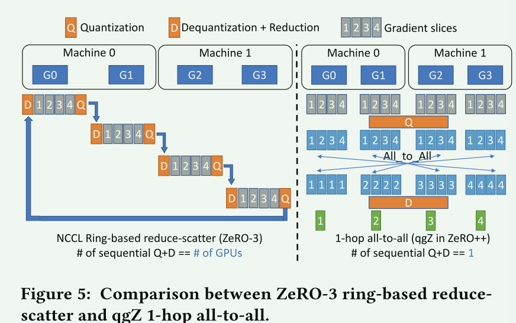
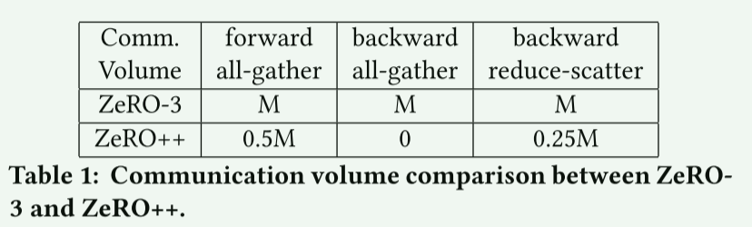
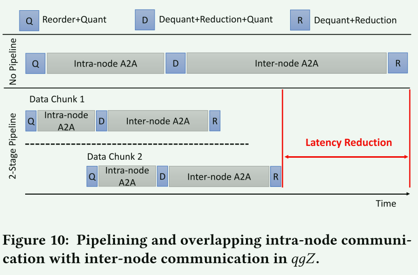

# ZeRO++：Extremely Efficient Collective Communication for Giant Model Training

## 01 背景

使用之前的ZeRO技术在低带宽的集群（通信时间过长）或者每个GPU的batch size较小（计算时间过短）时，因为在前向、后向传递和平均梯度的高通信量，导致ZeRO的吞吐量收到限制。

本文提出了三个减少通信量的技术：

1. **基于block-quantization的all-gather；**
2. **数据remapping；**
3. **用基于梯度量化平均范式的all-to-all代替reduce-scatter；**

## 02 相关技术

### 1. 量化Quantization

使用低精度来表示高精度数据，会带来精度损失。

## 03 Quantized Weight Communication for ZeRO (qwZ)

1. 为了优化**前向传递**中的all-gather的通信量，采用权重量化的方式，将每个模型参数从fp16压缩到int8，通信量减少一半。然后再接收端量化回fp16，再进行层计算。问题①会降低精度；②量化和非量化的耗时可能更大；

2. 为了保持模型训练精度，采用基于block的quantization（分块量化），对模型参数的每个子集进行独立量化。这需要在cuda core中优化实现。

   下图中每个权重tensor被切分成更小的chunk，Baseline中每个数采用统一的缩放系数，而Block量化中每个元素采用独立的量化系数。

## 04 Hierarchical Weight Partition for ZeRO (hpZ)

1. 为了优化**后向传递**中的all-gather的通信量，使用GPU显存进行通信。在每个服务器上都保存一个完整的模型，而不是将整个模型的权重分散到所有服务器上。将跨机的all-gather转变为机内的all-gather。

2. 根据GPU集群带宽分层的特征，先减少节点内的梯度，再减少跨节点通信量的减少。通过对节点内核节点间通信进行流水线化和CUDA融合，进一步减低时延。

   主分区：所有GPU构成；从分区：每个节点上GPU构成；每个从分区，保存有一份完整的模型参数。

   

   在前向计算中，先从主分区收集权重，计算结束之后按照从分区分发权重。后向计算中则基于从分区来收集权重。迭代结束时基于主分区更新所有模型状态以及fp16参数的主副本。

   

## 05 Quantized Gradient Communication for ZeRO (qgZ)

为了避免量化带来的数值精度的降低，提出新的梯度通信范式来替代Reduce-Scatter。在通信中使用基于block的INT4量化来压缩梯度来减少通信量，但是在Reducation算子之前恢复全部精度来保证训练的精度。

qgZ首先减少了节点内的梯度的通信量，进而最小化节点间的通信量。由于节点内的带宽要高于节点间的带宽，可以通过流水线节点内通信和节点间通信和CUDA内核融合来进一步降低延迟。

1. 原本N个GPU需要N个量化、去量化操作，会导致长延时和低精度。zero++放弃了基于ring的方法。先对给定的tensor进行量化，然后再所有GPU之间进行AlltoAll，最后采用还原方法恢复数据精度。

   

2. 使用AlltoAll代替ReduceScatter之后，会导致节点间通信量的上升。由原来的M(模型大小)变为N(GPU数量)*M/Z(数据压缩)

   

   使用分层的AlltoAll（先节点内对量化数据a2a，再对数据还原做缩减，再节点间a2a）

   

3. 但是双层AlltoAll会导致算子放置问题，节点间a2a之后，G1和G2的算子位置会错位。

   

   可以在进行第一次a2a之前先进行一次重排

   

4. 通信量分析

   只分析节点间的通信量。zero++在前向中通过量化，通信量变为0.5M(参数量)。后向传递中通过节点内的allgather，完全消除了跨节点通信。后向传播中的ReduceScatter用all2all代替之后通信量为0.25M。

   

## 06 优化实现

### 1、重叠计算和通信

#### 1. 权重上的计算、通信重叠

对于权重上的AllGather，① 跟踪模型层的执行顺序来获取它们被获取的顺序；② 保证异步的量化执行。

可以在不同的CUDA流上同时进行当前层的通信和下一层的量化。

#### 2. 分层AlltoAll重叠

将输入梯度张量、节点内通信和节点间通信流水线化。

