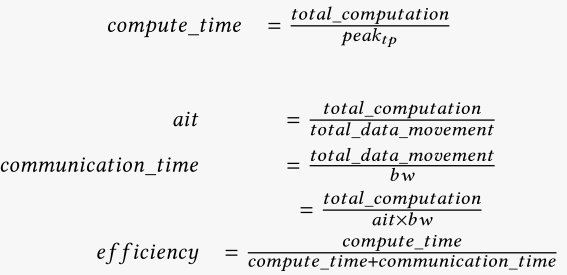
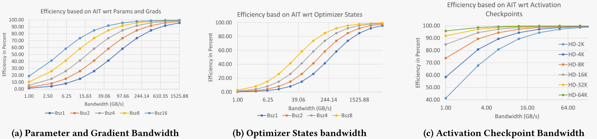
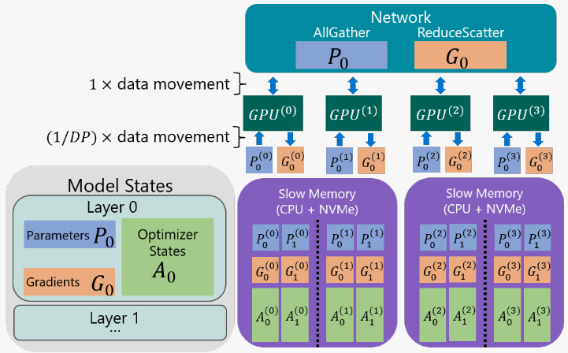

# ZeRO-Infinity: Breaking the GPU Memory Wall for Extreme Scale Deep Learning

[论文地址](https://dl.acm.org/doi/abs/10.1145/3458817.3476205)

## 01 背景介绍

目前最先进的大模型训练技术是**三维并行（3D parallelism）**，它在数百数千个GPU上，将模型并行、管道并行、数据并行结合起来，能训练数万亿参数的模型。3D并行在使用上很麻烦，需要重构代码进行模型切分。但是我们面临着GPU显存墙：显存根本不足以支撑模型规模的增长。

如今的很多场景需要进行大模型的微调，来使其可以被用于各种特定场景。但许多用户可以获得微调所需的计算资源，但是仍会遇到显存的限制。比如微调GPT-3需要128个V100GPU的3D并行，但是16个GPU就有计算它的能力。

**ZeRO（零冗余优化器）**通过划分模型状态（优化器状态、梯度、参数）来消除数据并行进程中的内存冗余。但是ZeRO只用到了显存。

**ZeRO-Offload**是在ZeRO-2的基础上，将梯度、优化器状态存储在CPU主存，但是它仍需要将参数存储在GPU显存中，并在所有设备上进行复制。所以ZeRO-Offload的模型规模被限制在单个GPU显存所能容纳的参数综述。其次还会受限于PCIE带宽。

## 02 内存要求分析

激活检查点、混合精度训练、模型状态占用分析和剩余状态分析之前整理过就不再重复，直接举例说明。

图1 大模型的内存要求

图2 V100集群上可用内存和带宽

上两张图显示，一个100B参数的模型的模型状态居然要占1.83TB的空间，这需要64张V100的显存才能将其放下。一个1T参数的模型就需要512个V100显存空间了。在实际训练中可以将参数、状态卸载到主存和磁盘，但是仍不能少于以下两者的要求。

**模型状态工作存储（MSWM）**：当所有的模型状态已经卸载到CPU和NVMe之后对模型中最大的单一算子进行前向或后向传播所需的最小GPU显存量。*至少要有足够的显存来存放该参数和梯度进行后向传播。*

**激活工作存储（AWM）**：在执行实际反向传播之前在反向传播中用于重新计算激活值所需要的存储。如果我们为每个Transformer块创建一个激活检查点，则内存由每个Transformer块的总激活大小给定。

## 03 带宽要求分析

将数据卸载到主存和NVMe的关键问题是它们有限的带宽有训练效率的影响。

作者列举了一系列公式来说明将内容卸载到CPU内存和NVMe中，有限的带宽会不会影响训练效率。

| 表达式                                    | 含义                                                         |
| ----------------------------------------- | ------------------------------------------------------------ |
| peak~tp~（peak computational throughput） | 计算峰值吞吐量                                               |
| bw（data movement bandwidth）             | 数据移动带宽                                                 |
| **ait（arithmetic intensity）**           | 工作负载的算术强度，总计算量与工作所需数据量之比，ait越高说明对数据移动带宽的要求更低，因为加载每个数据的同时可以进行更多的计算 |
| hd（hidden dimension）                    | 隐藏的维度，指输入向量、输出向量的维度                       |
| nl（the number of Transformer layers）    | Transformer模型的层数                                        |
| ci                                        | 两个激活检查点之间的Transformer块数                          |
| bsz（batch size）                         | 批量大小                                                     |
| seq（sequence length）                    | 序列长度                                                     |

$$
转换后的效率方程：efficiency = \frac{ait \times bw}{ait \times bw + peak_{tp}}
$$

### 量化DL训练中的AIT

通过首先确定训练的每次迭代中的**总计算量**，然后确定每个**模型状态和激活值的数据移动量**来量化它们。因为模型状态和激活值的数据量不同，所以它们的ait也不同。

① 每次迭代的**总计算量**由Transformer的线性层中的计算量决定。对于前向传播，这可以近似为参数数量、序列长度和批量大小的函数，为2 ×𝑏𝑠𝑧×𝑠𝑒𝑞×𝑝𝑎𝑟𝑎𝑚𝑠。后向传播的成本大约是前向传播的两倍。此外，激活检查点需要额外的前向计算作为后向传播期间重新计算的一部分。因此，每次迭代的总计算为：$$= 2 \times 4 \times bsz \times seq \times parameters \\ = 2 \times 4 \times 12 \times bsz\times seq \times nl \times hd^2$$  （前向1+后向2+激活前向1 = 4）（Transformer块中的几乎所有参数都来自每个块中的四个线性层，大小分别为（hd, 3hd）、（hd, hd）、（hd, 4hd）、（4hd, hd），所以$$parameters = 12 \times nl \times hd^2$$）

② 在正向、反向期间，模型参数必须至少2次从源位置加载到GPU，若存在激活检查点，要在反向传播期间加载一次参数来重计算。此外梯度至少1次从GPU寄存器移动到其最终位置。所以总共为$$4 \times parameters$$。

③ 在优化器步骤期间，必须至少读取优化器状态1次，且必须至少写入优化器状态1次。总数据移动量为2×optimizer_states = 2 × 16 × parameters

④ 激活检查值点的总数据移动为$$24 \times hd \times ci$$

上述的①分析了总计算量，②分析了模型参数和梯度的数据移动，③分析了优化器状态的数据移动，④分析了激活检查值点数据移动，所以可以分别得出ait。这块不理解的可以去看下原文，公式比较多。

### 带宽要求

通过上述的分析，作者得出了效率与可用带宽和参数、梯度、优化器状态、激活检查点的关系图。

图a显示了带宽与参数和梯度的关系，当使用超过**70GB/s**的带宽时，即使是最小的批量大小也可以实现超过50%的效率，理论上可以实现数据移动与计算的完全重叠。

图b显示了带宽与优化器参数的关系，相比参数、梯度，优化器状态要高出4倍的带宽才能实现50%的效率。并且优化器状态是在前向和后向传播结束时更新，不能与计算重叠。要达到90%的效率需要接近**1.5TB/s**的带宽。

图c显示了带宽与激活值的关系，较小的带宽也能使其维持50%的效率。

分析完数据卸载中对带宽的需求，我们来看下ZeRO-Infinity的总体设计，如何使得原本不够的带宽满足需求。

## 04 ZeRO-Infinity总体设计

该模型具有4个数据等级的2层结构。描绘了第一层反向传播的通信，分区参数从慢速存储器移动到GPU，然后收集以完成完整层。在计算梯度之后，它们被聚合、重新分区，然后再卸载到慢速存储。

### 1、前所未有的模型规模

**① 模型状态的无限卸载引擎**

构建在ZeRO-3上，对所有模型状态进行分区来消除内存冗余。并可以将所有分区的模型状态卸载到CPU主存或NVMe内存，或者根据内存需求将它们保留在GPU上。

**② 卸载激活值**

在必要时可以将激活值卸载到内存。

**③ 以内存为中心的平铺（不理解）**

利用ZeRO-3的数据获取和释放模式，通过将大型算子分解，便于顺序执行它们。例如，为了减少大型线性运算符的工作内存，ZeRO-Infinity将运算符表示为由原始运算符的参数组成的较小线性运算符的数学等价序列，并顺序执行它们。当与ZeRO-3结合使用时，每个图块的参数和梯度可以一次提取和释放一个，从而减少与图块数量成比例的工作内存。因此，ZeRO-Infinity可以支持任意大小的运算符，而不依赖于模型并行性来将它们适应有限的GPU内存。

### 2、优秀的训练效率

CPU主存的带宽比GPU显存慢一个数量级，NVMe带宽比CPU主存更慢一个数量级。通过上述带宽的分析，参数、梯度的带宽必须大于70GB/s，优化器状态的带宽必须大于1.5TB/s，激活检查点的带宽必须大于1~4GB/s。

**① 参数和梯度效率**

参数、梯度的数据移动带宽必须大于70GB/s，12GB/s的PCIe带宽根本不足以支持异构模型训练的规模，现有的ZeRO-Offload必须先将参数从CPU主存转移到所有的GPU。

本模型采用**以带宽为中心的分区**：一种新的数据映射和并行数据检索策略，用于卸载参数和梯度。后面详细介绍。

**以重叠为中心的设计**，允许ZeRO-Infinity不仅将GPU-GPU通信与计算重叠，还将NVMe-CPU和CPU-GPU通信通过PCIe重叠。后面详细介绍。

**② 优化器状态效率**

当将优化器状态卸载到CPU主存时，可以利用聚合GPU-CPU主存带宽以及聚合CPU计算进行优化步骤。当卸载到NVMe时，还要将数据从NVMe带到CPU内存来执行优化步骤，所以会受限于NVMe-CPU内存带宽的限制。要实现跨多个节点的聚合NVMe带宽来超过1.5TB/s的必要带宽。

无限卸载引擎不仅可以实现NVMe的峰值带宽，还可以将NVMe到CPU的读取与CPU到NVMe的写入重叠。后面详细介绍。

**③ 激活值的效率**

带宽不是问题，并且可以降低激活检查点的频率，将激活检查点与CPU内存之间的通信和GPU上的前向、后向计算重叠。

### 3、设计得易于使用

无需重构模型，与Pytorch结合，具有自动化功能来帮助使用者简单实现。

**① 数据自动移动**

通过在Pytorch子模块中注入钩子，在前向、后向之前，触发这些子模块的allgather来收集所需参数。

**② 初始化期间模型自动分区**

通过包装所有模块类的构造函数来实现这一点，以便在初始化期间创建每个子模块的参数后立即对它们进行分区和卸载。

## 05 效率优化

来详细说明上面总体模型中所用的技术。

### 1、以带宽为中心的分区

ZeRO和ZeRO-offload中每层的参数由单个数据并行进程拥有，该进程在需要时将它们广播到其余进程。

ZeRO-Infinity与上两者不同，它**在所有数据并行进程中划分各个参数，并在需要访问参数时使用allgather而不是广播。**

先介绍下广播与allgather的区别：

在广播中，每个参数由单个数据并行中的进程拥有，在广播发生之前，必须先将参数通过PCIe从源位置传送到GPU显存，由于数据为单个进程所有，所以仅单个PCIe是可活动的。

而allgather中，所有PCIe方法都是并行进行的，所以NVMe、主存到GPU之间的带宽随着并行度的增加而增加。

**broadcast是将一个节点上的数据发送到所有其他节点，而allgather是将所有节点上的数据收集到一个节点上。**

广播方式的话CPU/NVMe到GPU的带宽恒定在12GB/s，而在64个DGX-2节点上（64 × 16张卡）可以达到3TB/s和1.5TB/s的带宽，满足所需要求。

### 2、以重叠为中心的设计

虽然总带宽能达到要求，但是在单GPU上，仍有可能达到瓶颈，产生效率影响。提出了一个重叠引擎，**将GPU-CPU的通信与GPU计算重叠，将NVMe与CPU主存的通信、CPU与GPU的通信同时重叠。**

重叠引擎由2个部分组成：

**① 动态预取器**：在每次迭代期间，预取器跟踪它在运算符序列中的位置，并预取未来运算符所需的参数。比如在执行第i个运算之前，预取器会拿到后面三个操作所需的参数，从NVMe->CPU，CPU->GPU，allgather到全部GPU。

**② 通信和卸载重叠机制**：在反向传播期间，第i+1个算子中的参数的梯度的reduce-scatter可以和第i算子的计算重叠，同时将第i+2个算子的reduce-scatter后的梯度卸载到CPU和NVMe。

### 3、无限卸载引擎

**① DeepNVMe：**是C++ NVMe读/写库，支持异步完成的大容量读/写请求，刷新正在进行的读/写的同步请求。对异步的支持使ZeRO-Infinity实现通信与计算的重叠。

**② 固定内存管理层：**为了保证tensor读写的高性能，目标张量需要驻留在固定内存缓冲区。通过重用少量的内存，将整个模型状态卸载到CPU或者NVMe，还减少了内存碎片。

## 06 轻松实现

### 1、自动数据移动

这里用到了pytorch中的Hook for Modules机制，参考资料放这里：[Pytorch中的Hook机制](https://0809zheng.github.io/2020/12/11/hook.html)

ZeRO-Infinity递归地将钩子注入到模型的子模块，在子模块的前向传递过程中，这些钩子确保子模块的参数可以用于计算，否则它将执行适当的allgather，直到参数变得可用。在子模块的前向传递结束时，再划分参数并可选地卸载它们。

### 2、在初始化过程中的自动模型划分

模型的每一层的参数必须在初始化时被划分，所以通过一个context来装饰nn.Module的\_\_init\_\_方法，在每个子模块下分配参数使其初始化后立即在数据并行进程组中分区。

