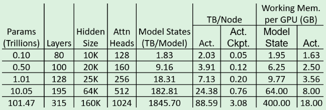
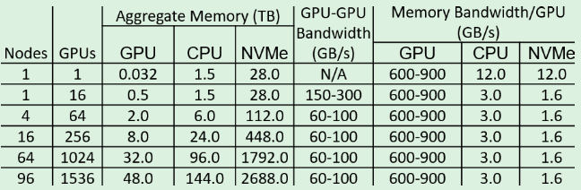

# ZeRO-Infinity: Breaking the GPU Memory Wall for Extreme Scale Deep Learning

[论文地址](https://dl.acm.org/doi/abs/10.1145/3458817.3476205)

## 01 背景介绍

​	目前最先进的大模型训练技术是**三维并行（3D parallelism）**，它在数百数千个GPU上，将模型并行、管道并行、数据并行结合起来，能训练数万亿参数的模型。3D并行在使用上很麻烦，需要重构代码进行模型切分。但是我们面临着GPU显存墙：显存根本不足以支撑模型规模的增长。

​	如今的很多场景需要进行大模型的微调，来使其可以被用于各种特定场景。但许多用户可以获得微调所需的计算资源，但是仍会遇到显存的限制。比如微调GPT-3需要128个V100GPU的3D并行，但是16个GPU就有计算它的能力。

​	**ZeRO（零冗余优化器）**通过划分模型状态（优化器状态、梯度、参数）来消除数据并行进程中的内存冗余。但是ZeRO只用到了显存。

​	**ZeRO-Offload**是在ZeRO-2的基础上，将梯度、优化器状态存储在CPU主存，但是它仍需要将参数存储在GPU显存中，并在所有设备上进行复制。所以ZeRO-Offload的模型规模被限制在单个GPU显存所能容纳的参数综述。其次还会受限于PCIE带宽。

## 02 内存要求分析

​	激活检查点、混合精度训练、模型状态占用分析和剩余状态分析之前整理过就不再重复，直接举例说明。

图1 大模型的内存要求

图2 V100集群上可用内存和带宽

​	上两张图显示，一个100B参数的模型的模型状态居然要占1.83TB的空间，这需要64张V100的显存才能将其放下。一个1T参数的模型就需要512个V100显存空间了。；

​	**模型状态工作存储（MSWM）**：当所有的模型状态已经卸载到CPU和NVMe之后对模型中最大的单一算子进行前向或后向传播所需的最小GPU显存量。至少要有足够的显存来存放该参数和梯度进行后向传播。

​	**激活工作存储（AWM）**：在执行实际反向传播之前在反向传播中用于重新计算激活值所需要的存储。
