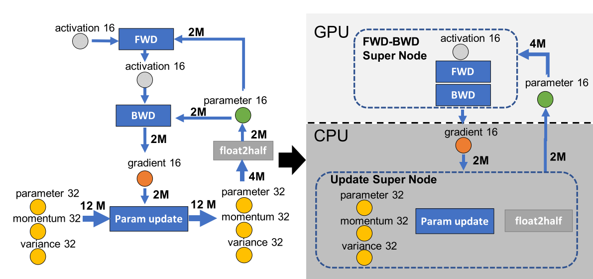
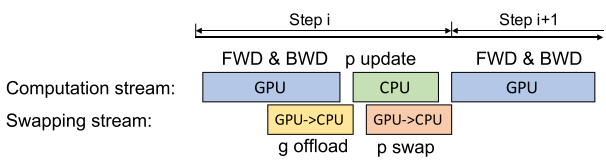
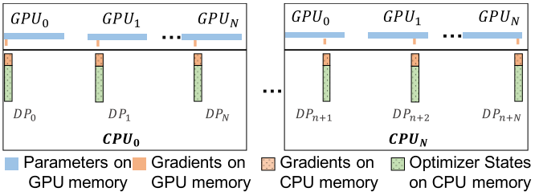
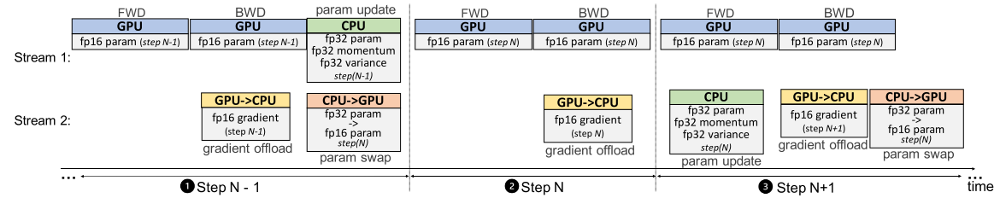
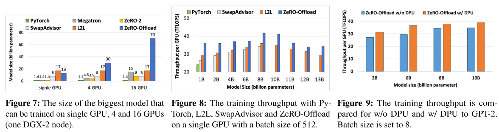
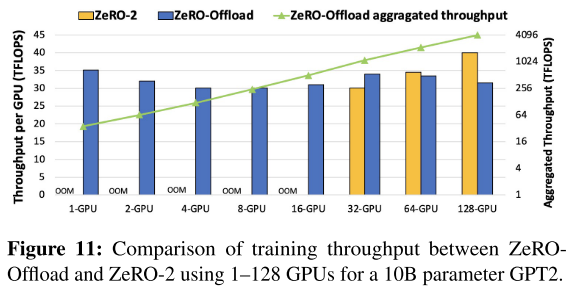

# ZeRO-Offload: Democratizing Billion-Scale Model Training

[论文地址](https://www.usenix.org/system/files/atc21-ren-jie.pdf)

## 01 背景介绍

​	近年来模型规模实现了三个数量级的增长，模型的准确性也随之不断提高。语言模型GPT-3的参数量达到了175B。

​	之前的用于大模型训练的技术，如**数据并行、管道并行、模型并行、ZeRO**等，都需要将模型状态（参数、梯度、优化器状态）进行分割，放到多个GPU上，来实现对单GPU显存限制的突破。但是所有这些并行技术都需要有足够的GPU，但是很多数据科学家、研究者仍旧无法获得相当多的GPU数量。要正确训练一个10B参数的模型，需要16台NVIDIA V100，成本约为5-10万，对于研究者来说，还是太高了。

​	而异构的深度学习训练是一种通过CPU内存（主存）来减少GPU显存需求的一种训练方法。CPU内存相对显存来讲十分廉价。

​	目前也有很多这方面的研究，但是他们主要是针对CNN模型，其内存瓶颈是激活值所占空间，且模型规模也比较小。目前的大模型主要基于Transformer架构，主要的内存瓶颈也变为了模型状态。**并且之前的所有研究都只是借用CPU内存来存储，而没有把CPU的计算资源利用起来。之前的研究也没有明确多GPU场景下的扩展训练。**

​	本文提出的ZeRO-Offload，这是一个**高效、可扩展、易于使用**的系统，微软开源了DeepSpeed。在pytorch中只需几行代码，就能在GPU上训练出多达10倍的模型。它还具有高度的可扩展性，实现了近乎线性的加速，最高可达128个GPU。

​	此外，它还可以与模型并行化相结合，训练更大的模型。

## 02 独特的最佳卸载策略

​	ZeRO-Offload将深度模型训练过程转换为数据流图。为了进行有效的划分，有三个关键点需要注意：

​	① 在CPU上的计算量要比在GPU上的少一个数量级，这可以防止CPU成为性能瓶颈；

​	② 要保证CPU和GPU内存之间的通信量最小；

​	③ 要实现最小通信量的同时最大限度地节省显存；

如上图所示，

​	在限制CPU计算方面，模型训练中每次迭代的复杂度一般为O(MB)，其中M为模型大小，B为batch大小。其中前向传播和后向传播中的计算复杂度为O(MB)，它们必须在GPU上完成。参数权重的更新复杂度为O(M)，可以把它们卸载到CPU完成。所以我们将前向和后向融合成为一个FWD-BWD Super Node放在GPU。

​	在减少通信量方面，我们必须避免PCI-E带宽成为训练性能的瓶颈。上述图中的任何切割方式都需要每边各2M，共4M的通信量。所以要将fp32精度的模型状态与它们的生产者、消费者放在一起，不能传输fp32的值。我们将fp32的参数、优化器状态和参数更新节点、float2half编译器放在一起构成Update Super Node放在CPU内存上，将fp16的参数分配到GPU上。

​	将fp16的梯度分配到CPU上来最大限度地节省显存。

## 03 任务调度

### 单GPU调度

​	前向传递之后是损失计算和后向传递，不需要与CPU进行任何通信。计算出的梯度会立即传输到CPU，所以不需要太多的内存来存储在GPU上。并且梯度传输和反向传播可以重叠，进一步降低通信成本，在CPU上执行FP32参数权重更新后，将该过程复制到FP16中的GPU参数，更新操作也可与传输操作重叠。然后重复执行。

### 扩展到多GPU

​	ZeRO-Offload可以和ZeRO-2一起配合使用，同时将划分的模型状态、梯度和相应的参数卸载到CPU主存中。

​	先进行划分再卸载还会带来一个好处，每个数据并行进程对应1个CPU和多张GPU，所有数据并行的GPU到CPU的通信量保持不变，还能使CPU的资源并行使用，来同时进行参数更新。

​	ZeRO-Offload在不同的GPU之间划分梯度和优化器状态，每个GPU将其拥有的分区加载到CPU内存中。在反向传播过程中，使用GPU上的reduce-scatter计算梯度并求平均值，并且每个GPU仅将属于其分区的平均梯度加载到CPU内存。优化器就由直接在CPU上的每个数据并行处理并行更新。更新后，参数分区被移回GPU，然后在GPU上进行类似于ZeRO-2的所有聚集操作，以收集所有参数。

## 05 优化CPU执行

### CPU-Adam 优化器

​	使用SIMD向量指令进行硬件并行化；

​	使用Loop unrolling进行指令级并行化；

​	使用OMP多线程来利用多个内核和线程。

### 单步延迟参数更新（DPU）

​	当批次规模较小时，CPU上的计算负载可能会接近GPU上的负载。在这种情况下，我们使用单步延迟参数更新（DPU）将GPU和CPU重叠一步；第（i+1）步的模型将使用第（i-1）步的梯度更新的参数而不是第i步更新的参数来训练，从而使CPU计算与GPU计算重叠。我们发现，经过几十次迭代后使用DPU并不会显著影响模型的准确性。

- ① 前N-1步在没有DPU的情况下进行训练，以避免在梯度快速变化的早期阶段使训练不稳定。
- ② 在第N步，我们从GPU获得梯度，但我们跳过CPU优化步骤，并且也不更新GPU上的fp 16参数。
- ③ 在第N+1步，我们使用来自第N步的梯度在CPU上计算参数更新，同时使用在步骤N-1处更新的参数在GPU上并行计算向前和向后传递。

## 06 实验

​	作者重点评估了GPT-2 和基于Transformer的模型，采用的基准线为PyTorch DDP、Megatron、SwapAdvisor、L2L、ZeRO-2；

​	图7 展示了单个GPU上ZeRO-Offload可以训练13B的模型，比其它方法大了9倍以上；在4个GPU、16个GPU上，PyTorch、L2L和SwapAdvisor的最大可训练模型规模保持不变，因为它们都没有处理数据并行的内存冗余。因此，它们的可扩展性被单个GPU上的模型规模所限制。Megatron和ZeRO-2都支持用更多的GPU进行大型模型训练，但它们不能有效地扩展到超过15B的参数。ZeRO-Offload通过分割和卸载优化器状态和梯度到CPU内存，轻松实现了高达70B参数模型的训练。

​	图8 展示了PyTorch、L2 L、SwapAdvisor和ZeRO-Offload在单个GPU上的训练吞吐量，批量大小为512。

​	图9 展示了比较具有 DPU和不具有 DPU情况下GPT-2的训练吞吐量。批次大小设置为8。可以提高每个GPU的吞吐量。

​	图11 展示了ZeRO-Offload即使在GPU数量增加(最多128个GPU)的情况下也能保持吞吐量线性增加。此外，还证实了当GPU数量增加，ZeRO-2的性能还会优于ZeRO-Offload。因为两者现在可以运行类似的批量大小，实现类似的计算效率，而ZeRO-2不会受到CPU-GPU通信的额外开销的影响。总之，ZeRO-Of fload是对ZeRO-2的补充，能够实现从单个设备到数千个设备的大型模型训练，具有良好的计算效率。

## 07 参考资料

1、[使用ZERO-OFFLOAD，现在可以在GPU上训练大10倍的模型! | AI-SCHOLAR | AI：（人工智能）文章和技术信息媒体](https://ai-scholar.tech/zh/articles/deep-learning/zero_offload)

2、[模型并行下利用ZeRO进行显存优化 - 知乎 (zhihu.com)](https://zhuanlan.zhihu.com/p/619429610)

3、[震惊！我竟然在1080Ti上加载了一个35亿参数的模型（ZeRO, Zero Redundancy Optimizer）_zero optimizer__大峰_的博客-CSDN博客](https://blog.csdn.net/weixin_43336281/article/details/126475071?ops_request_misc=%7B%22request%5Fid%22%3A%22168188703016800213078775%22%2C%22scm%22%3A%2220140713.130102334..%22%7D&request_id=168188703016800213078775&biz_id=0&utm_medium=distribute.pc_search_result.none-task-blog-2~all~baidu_landing_v2~default-7-126475071-null-null.142^v84^pc_search_v2,239^v2^insert_chatgpt&utm_term=ZeRO-offload&spm=1018.2226.3001.4187)

4、[DeepSpeed之ZeRO系列：将显存优化进行到底 | Yet Another Blog (basicv8vc.github.io)](https://basicv8vc.github.io/posts/zero/#zero-offload-让人人都能训练得起大模型)

