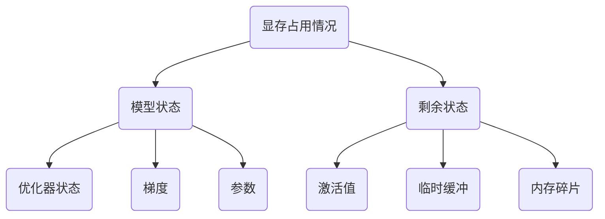

# ZeRO：Memory Optimizations Toward Training Trillion Parameter Models

[论文地址](https://ieeexplore.ieee.org/abstract/document/9355301)

## 01 背景介绍

现有的数据并行和模型并行的训练方法，有个一个问题：无法在少量的GPU上装下现在庞大的模型。比如一个1.5B参数的GPT-2模型使用TensorFlow或者PyTorch进行训练，我们发现它不能在一张具有32G显存的GPU上运行。

如今的模型从Bert-large（0.3B）快速增长到T5（11B），而显存只从12GB增长到80GB，远远不能满足模型的增长需求。所以，大模型显然不适合在单一的设备上进行训练，但是如果只是简单地增加更多的训练设备也是不可取的。

## 02 相关技术介绍

### 1、模型并行

当你有一个单卡装不下的大模型时，一个直接的解决办法是，把模型划分成不同的层，每一层都放到一块GPU上。

切分之后模型的前向传播和后向传播过程如下图所示：

这种方式有2个问题：

​	① GPU的利用率不够，可以从图中看出每块GPU都有很长的空闲时间来等待别的卡的计算。

​	② 前向传播过程中会产生大量的激活值，会占据大量的显存空间。

### 2、流水线并行（Pipeline Parallelism）

比如Gpipe，其核心思想：**在模型并行的基础上，进一步引入数据并行的办法，即把原先的数据再划分成若干个batch，送入GPU进行训练**。未划分前的数据，叫**mini-batch**。在mini-batch上再划分的数据，叫**micro-batch**。

将batch切好，并逐一送入GPU的过程，就像一个流水生产线一样。

对于激活值占用大量显存的问题，Gpipe采用用时间换取空间的思想，这种方法称为重计算（**re-materalization**）或者激活值检查点（**active checkpoint**）。我们可以在每块GPU上只保存来自上一块GPU的最后一层输出Z，其余的中间结果全部用完就舍弃，等到后向传播要再使用时就通过Z重新计算。

### 3、数据并行（DP）

如下图所示，数据并行并不需要更改模型，而是将输入数据进行切分，每个GPU上保存完整的模型参数，只输入部分参数进行训练。每个GPU做完一轮前向传播和后向传播之后，各自算出一份梯度G，之后每块GPU将自己的梯度推送给负责AllReduce的GPU做梯度聚合操作（累加）。聚合完毕之后，各个计算GPU再拉取完成的梯度结果，来更新各自的模型参数，使得各块GPU上的模型参数保持一致。这个先聚合再拉取梯度的过程叫做AllReduce。

数据并行有以下2个问题：

​	① 每个GPU要存储完整的模型参数，显存占用大；

​	② 每个GPU要进行Push/Pull操作，通信开销大，并且GPU3容易成为通信性能瓶颈；

### 4、分布式数据并行（DDP）

分布式DP主要缓解GPU之间的通信压力和性能瓶颈问题，提出了Ring-AllReduce算法。如下图所示，假设3张GPU各自算出的梯度g的下标为0、1、2，因为有3张卡，所以先将每张卡上的梯度切成3份，所以第0张卡上的梯度g0切分为a0、b0、c0

① Reduce-Scatter操作：相邻相加

经过2次相邻相加，每张卡上都有一块梯度拥有了对应位置的完整聚合（红色部分）。

② All-Gather操作：相邻复制

经过2次相邻复制，每张卡上的每个切块都拿到了完整的梯度信息。

我们接下来分析一下Ring-ALlReduce方法的通信量是多少。假设每张卡有X个参数，梯度的大小也为X，每个梯度块的大小为X/3，对于每张卡来说，第1个阶段发送了X/3+2X/3 = X 大小的通信量，第2个阶段发送了2X / 3 + X / 3 = X大小的通信量。所以总共产生了2X大小的通信量。相比较于DP，总体通信量没有增加，但是把通讯的负载分散到了每张卡，没有了单卡的通信瓶颈问题。

## 03 分析显存占用情况

在正式介绍ZeRO之前，我们先分析一下模型训练过程中的显存占用情况。

一个1.5B参数的GPT-2模型理论上只需要3GB的显存来用于16位精度的权重（或参数）的计算，然而，使用Tensorflow或PyTorch，它居然不能在具有32GB内存的单个GPU上训练。

显存的主要占用分为2个部分：

在模型训练的过程中我们采用的**混合精度训练**也是导致占用显存的元凶：

​	在模型进行计算时，采用fp16精度能加快模型的计算速度，但是在模型更新时，我们希望参数的精度越精确越好，所以我们会额外保存一份fp32精度的参数用来更新参数。

所以原先可能只要4X大小的模型，通过混合精度训练，就需要16X大小的空间了，大了整整四倍，这还没有考虑到激活值的大小，实际上会更加占空间。

## 04 ZeRO-DP

提出ZeRo中的第一部分：ZeRO-DP来解决数据冗余的问题。其核心思想是每张卡只保存一部分数据，其余数据用完就抛弃，等要用的时候就再从别的卡拿。

### ZeRO-1

在ZeRO-1中，我们将十分占据显存的fp32的数据（参数和优化器状态 ）进行切分，比如2张卡的情况下，就每张卡只存放一半的参数和优化器状态。

注意：这里我们虽然切分了模型的参数，但是这与模型并行有本质的不同，因为在我们进行参数更新时，我们会通过通信拿到完整的参数，所以还是数据并行。

经过ZeRO-1的优化，原本需要12X空间的fp32变成了12X/N。

### ZeRO-2

第二阶段的目标放在了fp16精度的梯度，即计算中的梯度。我们将其进行切分，每张卡只保留一部分。

过程：

​	① 每张卡在完成前向后向计算，算出各自的梯度，发送各自不维护的梯度到别的卡做累加，然后舍弃掉不维护的部分。

​	② 每张卡将自己保存的梯度用以更新对应的fp32的参数。

​	③ 参数更新完之后，再用fp32精度的参数生成fp16的参数进行下一轮的计算。

### ZeRO-3 

第三阶段把目标放在fp16的参数上，即计算过程中的参数。我们将其进行切分，每张卡只保留一部分。

过程：

​	④ 在要计算前，从别的卡上读取fp16的参数，来拿到完整的fp16参数。

注意：这个阶段会产生额外的2X/N的通信开销。

## 05 ZeRO-R

ZeRO中的第2部分用来优化剩余状态的显存占用。

### Partitioned Activation Checkpointing

过程：

​	① 跟模型并行一样，先进行参数划分；

​	② 将输入划分来存放；

​	③ 计算前复制输入来拿到全部输入；

​	④ 计算之后得到输出梯度G（部分），每张卡将自己不维护的梯度发送给别的卡做累加，然后舍弃，类似AllReduce；

​	⑤ 再做下一层的前向运算前，通过传输拿到全部的梯度G；

### Constant Size Buffers

① 提升带宽利用率。当GPU数量上升，GPU间的通讯次数也上升，每次的通讯量可能下降（但总通讯量不会变）。数据切片小了，就不能很好利用带宽了。所以这个buffer起到了积攒数据的作用：等数据积攒到一定大小，再进行通讯。

② 使得存储大小可控。在每次通讯前，积攒的存储大小是常量，是已知可控的。更方便使用者对训练中的存储消耗和通讯时间进行预估。

### Memory Defragmentation

设置机制，对碎片化的存储空间进行重新整合，整出连续的存储空间。防止出现总存储足够，但连续存储不够而引起的存储请求失败。

## 06 实验测试

在400张卡上跑ZeRO-100B（GPT-2），基准模型是Megatron-LM。

MP在GPU之间产生了很高的通信量，超过单节点以适应更大的模型会导致通信带宽从每条链路300GB/秒下降到12.5GB/秒，性能大幅下降。

从64张卡提升到128张卡时，性能提升不只有2倍，超线性提升。

因为当增加卡，模型和数据可以切分得更小，可以有更多的内存来存储中间状态，可以增大批量大小，导致每块卡做运算的时候的矩阵更大，能更好地利用单GPU的计算核心，导致单卡的性能提升。计算变多的同时，通讯没有变，使得计算/通信比更高了。也能使得通讯部分能更容易被计算部分覆盖掉。

## 07 参考资料

1、[Zero 论文精读【论文精读】_哔哩哔哩_bilibili](https://www.bilibili.com/video/BV1tY411g7ZT/?spm_id_from=333.999&vd_source=323a00595fc7f9d4eab187c159878fda)

2、[图解大模型训练之：数据并行下篇( DeepSpeed ZeRO，零冗余优化) - 知乎 (zhihu.com)](https://zhuanlan.zhihu.com/p/618865052)

3、[论文解读系列第十三篇：ZeRO——面向万亿级参数的模型训练方法 - 知乎 (zhihu.com)](https://zhuanlan.zhihu.com/p/116484241)

4、[DeepSpeed之ZeRO系列：将显存优化进行到底 | Yet Another Blog (basicv8vc.github.io)](https://basicv8vc.github.io/posts/zero/)

